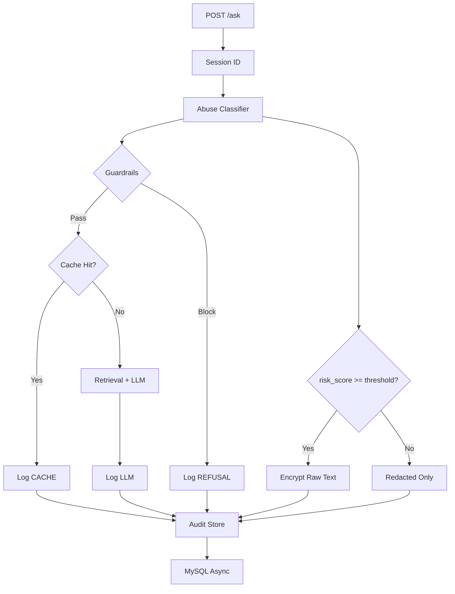

# Plano: Sistema de Audit Logging Completo

## Objetivo

Estender o sistema de rastreabilidade existente para incluir:

- Chat log completo (pergunta/resposta) com mensagens user/assistant
- Criptografia AES-GCM para texto bruto (controlado por flags)
- Classificação de abuso com score de risco
- Session tracking via headers
- Persistência detalhada de chunks e vetores (fingerprint)
- Headers de resposta (X-Answer-Source, X-Chat-Session-ID)

## Arquitetura



## Implementação

### 1. Dependências e Configuração

**Arquivos:**

- `backend/requirements.txt`: Adicionar `cryptography>=42.0.0` (já feito)
- `backend/requirements-extra.txt`: `mysql-connector-python` já existe
- `backend/app/config.py`: Adicionar novas settings
- `env.example`: Adicionar variáveis de ambiente

**Configurações a adicionar em `config.py`:**

```python
audit_log_enabled: bool = True
trace_sink: str = "noop"  # noop|mysql
audit_log_include_text: bool = True
audit_log_raw_mode: str = "risk_only"  # off|risk_only|always
audit_log_raw_max_chars: int = 2000
audit_log_redact: bool = True
audit_enc_key_b64: str | None = None
audit_enc_aad_mode: str = "trace_id"  # trace_id|request_id|none
abuse_classifier_enabled: bool = True
abuse_risk_threshold: float = 0.80
```

### 2. Novos Módulos

#### 2.1 `backend/app/crypto_simple.py`

- `load_key() -> bytes`: Carrega e valida chave AES-256 (32 bytes) de `AUDIT_ENC_KEY_B64`
- `key_id(key: bytes) -> str`: Retorna SHA256(key)[:16] para identificação
- `encrypt_text(plaintext: str, aad: bytes) -> dict`: 
  - Corta texto para `AUDIT_LOG_RAW_MAX_CHARS`
  - Gera nonce 12 bytes
  - AESGCM.encrypt(nonce, plaintext, aad) -> ciphertext+tag
  - Retorna envelope JSON: `{"alg":"AES-256-GCM", "kid":"...", "nonce_b64":"...", "ct_b64":"..."}`
- `decrypt_text(envelope: dict, aad: bytes) -> str`: Para debug/admin futuro

**AAD (Additional Authenticated Data):**

- `trace_id`: `trace_id.encode()`
- `request_id`: `request_id.encode()`
- `none`: `b""`

#### 2.2 `backend/app/redaction.py`

Extrair e melhorar funções de `trace_store.py`:

- `sha256_text(text: str) -> str`: Hash SHA256 do texto normalizado
- `normalize_text(text: str) -> str`: Trim, collapse whitespace, remove control chars
- `redact_text(text: str) -> str`: 
  - CPF: `\b\d{3}\.\d{3}\.\d{3}-\d{2}\b|\b\d{11}\b` → `[REDACTED_CPF]`
  - Cartão: `\b(?:\d[ -]*?){13,19}\b` → `[REDACTED_CARD]`
  - Token/Bearer: `bearer [REDACTED_TOKEN]`
  - API keys/secrets: `[REDACTED_SECRET_KEYWORD]`
  - Email: `[REDACTED_EMAIL]`
  - Telefone: `[REDACTED_PHONE]`

**Regra:** `text_hash` sempre do texto normalizado.

#### 2.3 `backend/app/abuse_classifier.py`

- `classify(question: str) -> tuple[float, list[str]]`:
  - Retorna `(risk_score: float, flags: list[str])`
  - Heurísticas:
    - Injection tokens (`ignore previous`, `reveal system prompt`, etc.) → +0.5, flag `"prompt_injection_attempt"`
    - Sensitive patterns (CPF, cartão, token, key) → +0.6, flag `"sensitive_input"`
    - Exfiltração (`reveal`, `system prompt`, `ignore instructions`) → +0.4
  - Clamp `risk_score` entre 0.0 e 1.0
  - Retorna flags como lista de strings

**Decisão de raw:**

- Se `risk_score >= ABUSE_RISK_THRESHOLD` e `AUDIT_LOG_RAW_MODE=risk_only` → salvar raw criptografado
- Senão → apenas redacted

#### 2.4 `backend/app/audit_store.py`

Interface assíncrona para persistência:

**Classes:**

- `AuditSink` (Protocol): `enqueue_session()`, `enqueue_message()`, `enqueue_ask()`, `enqueue_chunk()`, `shutdown()`
- `NoopAuditSink`: Implementação vazia
- `MySQLAuditSink`: 
  - Queue assíncrona (`queue.Queue`)
  - Worker thread daemon
  - Batch inserts ou inserts simples
  - Retry leve (1-2 tentativas)
  - Não bloqueia request

**Métodos:**

- `enqueue_session(session_id, user_id, client_fingerprint)`
- `enqueue_message(session_id, trace_id, role, text_hash, text_redacted, text_raw_enc, ...)`
- `enqueue_ask(trace_id, request_id, session_id, user_id, question_hash, answer_hash, answer_source, ...)`
- `enqueue_chunk(trace_id, rank, doc_id, chunk_id, scores, text_hash, excerpt_redacted)`
- `enqueue_vector_fingerprint(trace_id, embedding_model, vector_dim, vector_hash)` (opcional)

**Integração:**

- Se `TRACE_SINK!=mysql` ou `AUDIT_LOG_ENABLED!=1` → usar `NoopAuditSink`
- Reutilizar lógica de conexão de `MySQLTraceSink` (refatorar se necessário)

### 3. Schema MySQL

**Arquivo:** `docs/db_audit_schema.sql`

**Tabelas:**

1. **audit_session**

   - `session_id VARCHAR(64) PRIMARY KEY`
   - `user_id VARCHAR(64) NULL`
   - `created_at DATETIME NOT NULL DEFAULT CURRENT_TIMESTAMP`
   - `last_seen_at DATETIME NOT NULL DEFAULT CURRENT_TIMESTAMP ON UPDATE CURRENT_TIMESTAMP`
   - `client_fingerprint VARCHAR(128) NULL`
   - Índice: `(user_id, last_seen_at)`

2. **audit_message**

   - `id BIGINT PRIMARY KEY AUTO_INCREMENT`
   - `session_id VARCHAR(64) NOT NULL`
   - `trace_id VARCHAR(64) NOT NULL`
   - `role ENUM('user','assistant','system') NOT NULL`
   - `text_hash CHAR(64) NOT NULL`
   - `text_redacted MEDIUMTEXT NULL`
   - `text_raw_enc LONGTEXT NULL` (JSON envelope base64)
   - `text_raw_enc_alg VARCHAR(32) NULL` (ex: "AES-256-GCM")
   - `text_raw_enc_kid VARCHAR(64) NULL` (key id)
   - `created_at DATETIME NOT NULL DEFAULT CURRENT_TIMESTAMP`
   - Índices: `(session_id, created_at)`, `(trace_id)`
   - FK: `session_id` → `audit_session(session_id)`

3. **audit_ask**

   - `trace_id VARCHAR(64) PRIMARY KEY`
   - `request_id VARCHAR(64) NOT NULL`
   - `session_id VARCHAR(64) NOT NULL`
   - `user_id VARCHAR(64) NULL`
   - `question_hash CHAR(64) NOT NULL`
   - `answer_hash CHAR(64) NOT NULL`
   - `answer_source ENUM('CACHE','LLM','REFUSAL') NOT NULL`
   - `confidence FLOAT NULL`
   - `refusal_reason VARCHAR(64) NULL`
   - `cache_key CHAR(64) NULL`
   - `cache_hit BOOLEAN NOT NULL DEFAULT FALSE`
   - `llm_model VARCHAR(128) NULL`
   - `latency_ms INT NULL`
   - `abuse_risk_score FLOAT NULL`
   - `abuse_flags_json TEXT NULL` (JSON array de strings)
   - `created_at DATETIME NOT NULL DEFAULT CURRENT_TIMESTAMP`
   - Índices: `(session_id, created_at)`, `(user_id, created_at)`
   - FK: `session_id` → `audit_session(session_id)`

4. **audit_retrieval_chunk**

   - `id BIGINT PRIMARY KEY AUTO_INCREMENT`
   - `trace_id VARCHAR(64) NOT NULL`
   - `rank INT NOT NULL`
   - `doc_id VARCHAR(128) NULL`
   - `document VARCHAR(255) NULL`
   - `path VARCHAR(512) NULL`
   - `chunk_id VARCHAR(128) NULL`
   - `chunk_index INT NULL`
   - `score_similarity FLOAT NULL`
   - `score_trust FLOAT NULL`
   - `score_freshness FLOAT NULL`
   - `score_final FLOAT NULL`
   - `text_hash CHAR(64) NOT NULL`
   - `excerpt_redacted TEXT NULL`
   - `created_at DATETIME NOT NULL DEFAULT CURRENT_TIMESTAMP`
   - Índice: `(trace_id, rank)`
   - FK: `trace_id` → `audit_ask(trace_id)`

5. **audit_vector_fingerprint** (opcional)

   - `trace_id VARCHAR(64) PRIMARY KEY`
   - `embedding_model VARCHAR(128) NOT NULL`
   - `vector_dim INT NOT NULL`
   - `vector_hash CHAR(64) NOT NULL` (SHA256 do vetor serializado)
   - `created_at DATETIME NOT NULL DEFAULT CURRENT_TIMESTAMP`
   - FK: `trace_id` → `audit_ask(trace_id)`

### 4. Instrumentação do `/ask` (main.py)

**Modificações em `backend/app/main.py`:**

1. **Session ID:**

   - Ler header `X-Chat-Session-ID` do request
   - Se não existir, gerar `uuid4().hex[:16]`
   - Retornar no header `X-Chat-Session-ID` da resposta
   - Persistir/atualizar `audit_session` (touch `last_seen_at`)

2. **Abuse Classification:**

   - Chamar `abuse_classifier.classify(question)` após normalização
   - Armazenar `risk_score` e `flags` para uso posterior

3. **Answer Source:**

   - Determinar origem: `CACHE`, `LLM`, ou `REFUSAL`
   - Retornar no header `X-Answer-Source`

4. **Logging de Mensagens:**

   - **User message:** Após normalização, salvar `audit_message` com `role='user'`
   - **Assistant message:** Após gerar resposta, salvar `audit_message` com `role='assistant'`
   - **Raw encryption:** Se `AUDIT_LOG_RAW_MODE=always` ou (`risk_only` e `risk_score >= threshold`), criptografar e salvar

5. **Logging de Chunks:**

   - Após retrieval, persistir `audit_retrieval_chunk` para cada chunk retornado (topK)
   - Incluir scores, text_hash, excerpt_redacted (se `AUDIT_LOG_INCLUDE_TEXT=1`)
   - Se cache hit e resposta inclui sources, persistir chunks do cache também

6. **Logging de Ask:**

   - Persistir `audit_ask` com todos os metadados:
     - `answer_source`, `cache_hit`, `cache_key`, `llm_model`, `latency_ms`
     - `abuse_risk_score`, `abuse_flags_json`
     - `confidence`, `refusal_reason`

7. **Headers de Resposta:**

   - `X-Trace-ID`: já existe
   - `X-Answer-Source`: `CACHE` | `LLM` | `REFUSAL`
   - `X-Chat-Session-ID`: session_id

8. **Integração com Cache:**

   - Se cache hit, ainda logar mensagens user/assistant
   - Se resposta cacheada inclui sources, persistir chunks também
   - Marcar `answer_source=CACHE` e `cache_hit=true`

### 5. Testes

#### 5.1 Unit Tests (`backend/tests/test_audit_*.py`)

**test_audit_headers.py:**

- `/ask` sempre retorna `X-Trace-ID`, `X-Answer-Source`, `X-Chat-Session-ID`
- `X-Answer-Source` está em `{CACHE,LLM,REFUSAL}`
- `X-Chat-Session-ID` é persistido entre requests (se enviado)

**test_audit_redaction.py:**

- `AUDIT_LOG_INCLUDE_TEXT=1` e `AUDIT_LOG_REDACT=1` → `text_redacted` não contém CPF/cartão/tokens
- `text_hash` é consistente (mesmo texto = mesmo hash)

**test_audit_crypto.py:**

- `AUDIT_LOG_RAW_MODE=always` → `text_raw_enc` não é nulo
- Envelope JSON válido com `alg`, `kid`, `nonce_b64`, `ct_b64`
- Decrypt funciona com AAD correto

**test_abuse_classifier.py:**

- Injection tokens → `risk_score >= 0.5`, flag `prompt_injection_attempt`
- Sensitive patterns → `risk_score >= 0.6`, flag `sensitive_input`
- Score clampado entre 0.0 e 1.0

#### 5.2 Prod-like Tests (`backend/tests/prodlike/test_prodlike_audit.py`)

- Chamada 1 (miss) → `answer_source=LLM`, `audit_ask` e `audit_message` gravados, `audit_retrieval_chunk > 0`
- Chamada 2 (hit) → `answer_source=CACHE`, não faz retrieval/LLM, mas loga mensagens
- Abuso → `answer_source=REFUSAL`, `risk_score` alto, flags presentes
- `risk_only` mode → raw criptografado apenas quando `risk >= threshold`

### 6. Documentação

#### 6.1 `docs/audit_logging.md`

- O que é gravado por padrão (redacted sempre, raw condicional)
- Como habilitar raw criptografado (`AUDIT_LOG_RAW_MODE`)
- Como gerar `AUDIT_ENC_KEY_B64`: `python -c "import os,base64; print(base64.b64encode(os.urandom(32)).decode())"`
- Queries SQL simples para consultar:
  - Mensagens de uma session
  - Chunks de um trace
  - Perguntas com alto risco de abuso
- Retenção recomendada: 30 dias raw, 180 dias metadados
- Aviso LGPD: mínimo necessário, redação automática

#### 6.2 Atualizar `README.md`

- Seção "Auditabilidade e Rastreabilidade"
- Exemplos de headers retornados
- Como buscar trace no DB (queries básicas)
- Configuração de criptografia

### 7. Compatibilidade

**Manter funcionamento existente:**

- `PipelineTrace` e `MySQLTraceSink` continuam funcionando (não remover)
- Sistema de audit é adicional, não substitui trace atual
- Se `AUDIT_LOG_ENABLED=0` ou `TRACE_SINK!=mysql`, usar `NoopAuditSink` (não quebra)
- Headers novos são adicionais (não quebram clientes existentes)

## Ordem de Implementação

1. ✅ Dependências (já feito: `cryptography`)
2. Configuração (`config.py`, `env.example`)
3. Módulos base: `redaction.py`, `crypto_simple.py`, `abuse_classifier.py`
4. `audit_store.py` (interface e MySQL)
5. Schema SQL (`db_audit_schema.sql`)
6. Instrumentação `main.py` (session, messages, chunks, headers)
7. Testes unitários
8. Testes prod-like
9. Documentação

## Notas de Segurança

- Chave de criptografia: **nunca** commitar no código ou logs
- AAD (trace_id/request_id) previne replay entre traces
- Redação sempre aplicada antes de salvar texto
- Raw apenas quando necessário (always ou risk_only com threshold)
- Hash sempre do texto normalizado (consistência)

## Entrega Final

- Sistema funciona sem MySQL (NoopAuditSink)
- Com MySQL configurado, persiste tudo assincronamente
- Headers retornados em todas as respostas
- Testes passando (unit + prod-like)
- Documentação completa