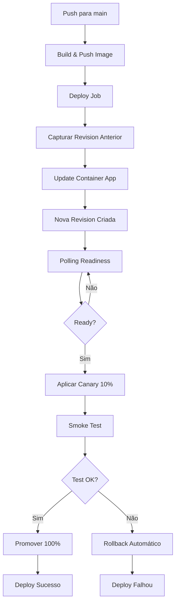

# Plano: Canary Deployment com Revisions - Azure Container Apps

## Objetivo

Implementar deployment seguro usando **Revisions com Canary** no Azure Container Apps, eliminando o risco de colocar 100% do tráfego em uma versão não testada. O deployment deve:

1. Criar nova revision sem tráfego inicial
2. Aguardar readiness via polling (não sleep fixo)
3. Aplicar canary (10% tráfego)
4. Executar smoke test
5. Promover para 100% se OK, ou fazer rollback automático se falhar

## Arquitetura do Fluxo



## Alterações Necessárias

### Arquivos a Modificar

1. **`.github/workflows/deploy-azure.yml`**

   - Substituir `Wait for new revision` (sleep 30s) por polling inteligente
   - Adicionar step para capturar revision anterior
   - Implementar canary deployment (10% tráfego)
   - Mover smoke test para ANTES de promover 100%
   - Implementar rollback automático
   - Adicionar variável `CANARY_WEIGHT` (default 10)

2. **`infra/ci/wait_revision_ready.sh`** (NOVO)

   - Script para polling de readiness da revision
   - Verificar `provisioningState` e `runningState`
   - Verificar replicas ready (se disponível)
   - Timeout configurável (default 5min)
   - Retry com backoff exponencial

3. **`infra/ci/rollback_revision.sh`** (NOVO)

   - Script para rollback automático
   - Restaurar tráfego 100% para revision anterior
   - Registrar motivo do rollback
   - Output para GitHub Step Summary

4. **`docs/deployment_azure.md`**

   - Adicionar seção "Canary Deployment"
   - Documentar processo de rollback
   - Explicar polling vs sleep
   - Adicionar troubleshooting para canary

5. **`docs/ci_cd.md`** (NOVO)

   - Documentar fluxo completo do pipeline
   - Explicar canary deployment
   - Como fazer rollback manual
   - Como testar localmente

## Implementação por Commits

### Commit 1: Script de Polling de Readiness

**Arquivo**: `infra/ci/wait_revision_ready.sh`

Script que:

- Aceita parâmetros: `APP_NAME`, `RESOURCE_GROUP`, `REVISION_NAME`, `TIMEOUT` (default 300s)
- Faz polling a cada 5s verificando:
  - `provisioningState == "Succeeded"`
  - `runningState == "Running"` (quando disponível)
  - Replicas ready (se `scale` configurado)
- Retorna exit code 0 se ready, 1 se timeout
- Logs claros com progresso

**Uso no workflow**:

```yaml
- name: Wait for revision readiness
  run: |
    chmod +x infra/ci/wait_revision_ready.sh
    infra/ci/wait_revision_ready.sh \
      "${{ steps.state.outputs.api_app }}" \
      "${{ steps.state.outputs.resource_group }}" \
      "$REVISION_NAME" \
      300
```

### Commit 2: Capturar Revision Anterior e Criar Nova

**Arquivo**: `.github/workflows/deploy-azure.yml`

Modificar step `Update Container App with new image`:

- Antes de atualizar, capturar revision ativa atual:
  ```bash
  PREV_REVISION=$(az containerapp revision list \
    --name $APP \
    --resource-group $RG \
    --query "[?properties.active==\`true\`].name" -o tsv | head -n1)
  ```

- Salvar em output: `prev_revision`
- Atualizar Container App (cria nova revision automaticamente)
- Obter nova revision name imediatamente após update

Substituir step `Wait for new revision`:

- Remover `sleep 30`
- Usar script `wait_revision_ready.sh` com polling

### Commit 3: Implementar Canary Deployment

**Arquivo**: `.github/workflows/deploy-azure.yml`

Adicionar variável de ambiente:

```yaml
env:
  CANARY_WEIGHT: 10  # 10% tráfego para nova revision
```

Adicionar step após readiness:

```yaml
- name: Apply canary traffic split
  run: |
    NEW_REV=${{ steps.wait_revision.outputs.revision_name }}
    PREV_REV="${{ steps.capture_prev.outputs.prev_revision }}"
    CANARY_WEIGHT=${CANARY_WEIGHT:-10}
    PREV_WEIGHT=$((100 - CANARY_WEIGHT))
    
    az containerapp ingress traffic set \
      --name ${{ steps.state.outputs.api_app }} \
      --resource-group ${{ steps.state.outputs.resource_group }} \
      --revision-weight ${NEW_REV}=${CANARY_WEIGHT} ${PREV_REV}=${PREV_WEIGHT}
```

### Commit 4: Mover Smoke Test e Implementar Rollback

**Arquivo**: `.github/workflows/deploy-azure.yml`

**Mover job `smoke-test`**:

- Mudar `needs: deploy` para rodar DENTRO do job `deploy` (como step)
- Executar APÓS aplicar canary, ANTES de promover 100%

**Criar script de rollback**: `infra/ci/rollback_revision.sh`

- Aceita: `APP_NAME`, `RESOURCE_GROUP`, `PREV_REVISION`
- Restaura 100% tráfego para revision anterior
- Desativa nova revision (opcional)
- Registra no summary

**Lógica no workflow**:

```yaml
- name: Run smoke test on canary
  id: smoke_test
  run: |
    # ... smoke test code ...
    # Se falhar, exit 1

- name: Rollback on smoke test failure
  if: failure() && steps.smoke_test.outcome == 'failure'
  run: |
    chmod +x infra/ci/rollback_revision.sh
    infra/ci/rollback_revision.sh \
      "${{ steps.state.outputs.api_app }}" \
      "${{ steps.state.outputs.resource_group }}" \
      "${{ steps.capture_prev.outputs.prev_revision }}"
    exit 1

- name: Promote to 100%
  if: success() && steps.smoke_test.outcome == 'success'
  run: |
    az containerapp ingress traffic set \
      --name ${{ steps.state.outputs.api_app }} \
      --resource-group ${{ steps.state.outputs.resource_group }} \
      --revision-weight ${NEW_REV}=100
```

### Commit 5: Melhorar Summary e Logs

**Arquivo**: `.github/workflows/deploy-azure.yml`

Adicionar step `Deployment summary` no final do job `deploy`:

- Mostrar revision anterior vs nova
- Mostrar canary weight usado
- Mostrar resultado do smoke test
- Mostrar comandos de rollback manual (se necessário)
- Tabela de revisions com traffic weights

### Commit 6: Documentação Completa

**Arquivos**:

- `docs/ci_cd.md` (NOVO)
- `docs/deployment_azure.md` (ATUALIZAR)

**Conteúdo**:

#### `docs/ci_cd.md`:

- Visão geral do pipeline
- Fluxo de canary deployment (com diagrama)
- Como funciona o polling
- Como funciona o rollback
- Como fazer rollback manual
- Troubleshooting comum

#### Atualizar `docs/deployment_azure.md`:

- Adicionar seção "Canary Deployment" após "Rollback e Revisões"
- Explicar diferença entre canary e deploy direto
- Adicionar troubleshooting para:
  - Revision não fica ready
  - Smoke test falha no canary
  - Rollback não funciona

## Detalhes Técnicos

### Polling de Readiness

O script `wait_revision_ready.sh` deve verificar:

```bash
# 1. Provisioning State
PROV_STATE=$(az containerapp revision show \
  --name $APP \
  --resource-group $RG \
  --revision $REV \
  --query "properties.provisioningState" -o tsv)

# 2. Running State (se disponível)
RUN_STATE=$(az containerapp revision show \
  --name $APP \
  --resource-group $RG \
  --revision $REV \
  --query "properties.runningState" -o tsv 2>/dev/null || echo "")

# 3. Replicas (se scale configurado)
READY_REPLICAS=$(az containerapp revision show \
  --name $APP \
  --resource-group $RG \
  --revision $REV \
  --query "properties.replicas" -o tsv 2>/dev/null || echo "0")
```

### Traffic Split no Azure Container Apps

Comando correto:

```bash
az containerapp ingress traffic set \
  --name $APP \
  --resource-group $RG \
  --revision-weight <REV1>=<WEIGHT1> <REV2>=<WEIGHT2>
```

**Importante**: Somas dos weights devem ser 100.

### Smoke Test no Canary

Como o smoke test vai pegar apenas 10% do tráfego:

- Aumentar retries (de 5 para 10)
- Aumentar timeout inicial
- Adicionar log indicando que está testando canary
- Considerar fazer múltiplas requisições para aumentar chance de pegar canary

## Validação

Após implementação, validar:

1. **Deploy bem-sucedido**:

   - Nova revision criada
   - Canary aplicado (10% tráfego)
   - Smoke test passa
   - Promoção para 100%

2. **Deploy com falha**:

   - Nova revision criada
   - Canary aplicado
   - Smoke test falha
   - Rollback automático executa
   - Tráfego volta 100% para revision anterior

3. **Polling funciona**:

   - Não usa sleep fixo
   - Detecta readiness corretamente
   - Timeout funciona se revision não ficar ready

## Riscos e Mitigações

| Risco | Mitigação |

|-------|-----------|

| Smoke test pode não pegar canary (10% tráfego) | Aumentar retries e fazer múltiplas requisições |

| Polling pode timeout muito cedo | Timeout configurável (default 5min) |

| Rollback pode falhar | Script robusto com retries, fallback manual documentado |

| Canary pode causar problemas em prod | Peso configurável (default 10%, pode reduzir para 5%) |

## Próximos Passos (Opcional)

Após implementação básica, considerar:

1. **Promoção gradual**: 10% → 50% → 100% (com smoke test em cada etapa)
2. **Métricas de canary**: Monitorar erro rate, latência durante canary
3. **Auto-promotion**: Se métricas OK por X minutos, promover automaticamente
4. **Feature flags**: Integrar com sistema de feature flags para controle fino