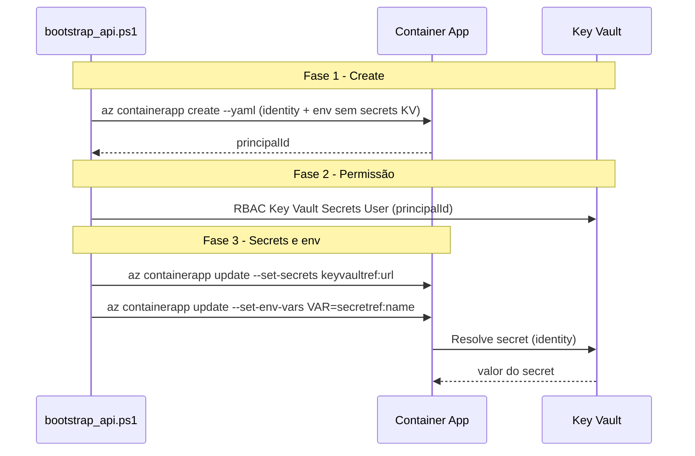

# Migração Key Vault para padrão Azure Container Apps

## A) Inventário (relatório para PR)

### Arquivos afetados

**YAMLs de Container App (contêm `value: "@Microsoft.KeyVault(...)"`):**

- 9 arquivos na raiz: `app_bootstrap_20260128*.yaml`, `app_recreate_20260128*.yaml`
- Origem: gerados pelo [infra/bootstrap_api.ps1](infra/bootstrap_api.ps1) quando o create falha (YAML mantido para debug) ou exportados com `az containerapp show -o yaml`. O script atual **não** injeta @Microsoft.KeyVault no YAML inicial de create (fase chicken-and-egg); esses arquivos são artefatos antigos/exportados.

**Bicep:** [azure/bicep/main.bicep](azure/bicep/main.bicep) — **já correto**: usa `secrets: [ { name, keyVaultUrl, identity: 'system' } ]` e `env: [ { secretRef } ]` (linhas 161-256). Nenhuma alteração necessária.

**PowerShell (criação/atualização de container app ou KV):**

- [infra/bootstrap_api.ps1](infra/bootstrap_api.ps1) — já usa `keyvaultref:` e `secretRef:` no fluxo de update; YAML inicial sem secrets KV. Ajuste: garantir que YAML gerado (quando mantido em disco) nunca contenha @Microsoft.KeyVault (hoje já não contém).
- [infra/fix_keyvault_references.ps1](infra/fix_keyvault_references.ps1) — já converte para keyvaultref + secretRef via CLI. OK.
- [infra/validate_keyvault_syntax.ps1](infra/validate_keyvault_syntax.ps1) — hoje **ignora** `app_(bootstrap|recreate)_\d+\.yaml`; alinhar com critério “zero @Microsoft.KeyVault em YAMLs de ACA”.
- [azure/setup-keyvault.ps1](azure/setup-keyvault.ps1), [azure/setup-keyvault.sh](azure/setup-keyvault.sh) — exemplos impressos usam @Microsoft.KeyVault; atualizar para ACA (keyvaultref/secretRef).
- `infra/old/*.ps1` — vários injetam @Microsoft.KeyVault; fora do escopo ativo (manter como legado; não usar em deploy).

**Documentação:**

- [docs/deployment_azure.md](docs/deployment_azure.md) — linhas 152 e 218-222: texto e exemplo com @Microsoft.KeyVault; atualizar para ACA.
- [azure/DEPLOYMENT.md](azure/DEPLOYMENT.md) — nota sobre @Microsoft.KeyVault (linha 235); exemplos já usam keyvaultref em parte; padronizar.
- [azure/README.md](azure/README.md) — exemplos com keyvaultref; verificar consistência.
- [azure/QUICKSTART.md](azure/QUICKSTART.md) — linhas 73-74: exemplos com @Microsoft.KeyVault; substituir por ACA.
- [docs/runbook_add_keyvault_secret.md](docs/runbook_add_keyvault_secret.md) — já em formato ACA; apenas garantir que não reste exemplo com @Microsoft.KeyVault como recomendação.

**CI:** [.github/workflows/deploy-azure.yml](.github/workflows/deploy-azure.yml) — já chama `infra/validate_keyvault_syntax.ps1`; após ajustes no validador e remoção dos YAMLs artefato, a checagem continuará no pipeline.

---

## B) Migração nos YAMLs (ACA correto)

### 1. YAMLs artefato na raiz

- **Remover** os 9 arquivos `app_bootstrap_*.yaml` e `app_recreate_*.yaml` do repositório (são artefatos de debug/export, não fonte de verdade).
- **Incluir** em `.gitignore` os padrões:
  - `app_bootstrap_*.yaml`
  - `app_recreate_*.yaml`

para evitar commit futuro de YAMLs gerados com timestamp.

### 2. Template YAML canônico (opcional)

- Se quiser um YAML de referência para deploy manual ou troubleshooting, criar **um** arquivo em ACA, por exemplo `azure/container-app-api-template.yaml`, com:
  - `properties.identity.type: SystemAssigned`
  - `properties.configuration.secrets` com entradas no formato:
    - `name:` kebab-case (ex.: `mysql-password`, `openai-api-key`)
    - `keyVaultUrl:` `https://<kv>.vault.azure.net/secrets/<name>` (sem versão no path)
    - `identity:` `system`
  - `env` com `secretRef` (nunca `value: "@Microsoft.KeyVault(...)"`).

### 3. Bootstrap e YAML gerado

- Em [infra/bootstrap_api.ps1](infra/bootstrap_api.ps1) o YAML inicial de create **já não** contém env vars com @Microsoft.KeyVault (apenas non-secrets). Os secrets KV são aplicados depois via `az containerapp update --set-secrets` e `--set-env-vars` com secretRef. Nenhuma alteração obrigatória; apenas garantir que, se no futuro o script escrever um YAML de “estado atual” para disco, use sempre keyVaultUrl + identity + secretRef.

---

## C) PowerShell: adequação do fluxo

### 1. [infra/bootstrap_api.ps1](infra/bootstrap_api.ps1)

- **Já em duas fases:** create (com identity no YAML) → RBAC no KV → `az containerapp update --set-secrets` + `--set-env-vars` com secretRef. Não injeta @Microsoft.KeyVault.
- **Ajustes sugeridos:**
  - Garantir que o YAML escrito em `$tempYaml` (quando create falha e o arquivo é mantido) nunca receba env com `value: "@Microsoft.KeyVault(...)"`. Hoje o bloco de create não adiciona secrets KV ao YAML; manter essa regra.
  - Opcional: escrever YAML temporário em diretório já ignorado (ex.: `.azure/` ou `infra/out/`) e usar nome que deixe claro que é artefato (ex.: `container-app-api-debug.yaml`).

### 2. [azure/setup-keyvault.ps1](azure/setup-keyvault.ps1) e [azure/setup-keyvault.sh](azure/setup-keyvault.sh)

- Substituir exemplos que mostram `@Microsoft.KeyVault(SecretUri=...)` por:
  - **Secrets no ACA:** `--set-secrets "openai-api-key=keyvaultref:https://<kv>.vault.azure.net/secrets/openai-api-key"` (e equivalente para audit-enc-key-b64).
  - **Env vars:** `--set-env-vars "OPENAI_API_KEY=secretref:openai-api-key"` (ou equivalente), deixando claro que o valor não deve ser @Microsoft.KeyVault.

### 3. [infra/validate_keyvault_syntax.ps1](infra/validate_keyvault_syntax.ps1)

- Remover a exclusão de `app_(bootstrap|recreate)_\d+\.yaml` na verificação de YAMLs, para que **qualquer** YAML com `@Microsoft.KeyVault` falhe (após remover os 9 arquivos e adicionar ao .gitignore, não haverá mais YAMLs com esse padrão no repo).
- Manter/refinar a regra que falha se scripts PS1 (exceto os de fix/check/diagnose/old) injetarem @Microsoft.KeyVault em env/yaml.
- Opcional: falhar se em YAML de Container App existir `value:` que contenha a substring `@Microsoft.KeyVault` (detecção explícita de env var errada).

### 4. infra/old/

- Não alterar scripts em `infra/old/`. Documentar em README ou runbook que esses scripts são legado e não devem ser usados para deploy; o fluxo oficial é o bootstrap_api.ps1 (e Bicep quando aplicável).

---

## D) Documentação

- **[docs/deployment_azure.md](docs/deployment_azure.md):**
  - Trocar “Secrets: Key Vault references (@Microsoft.KeyVault(...))” por “Secrets: keyVaultUrl + identity em configuration.secrets; env vars via secretRef”.
  - Substituir o exemplo “Usar Key Vault References” (--set-env-vars com @Microsoft.KeyVault) por:
    - Primeiro `--set-secrets "openai-api-key=keyvaultref:https://$($state.keyVaultName).vault.azure.net/secrets/openai-api-key"`.
    - Depois `--set-env-vars "OPENAI_API_KEY=secretref:openai-api-key"`.
  - Incluir breve nota: “Container Apps não resolvem @Microsoft.KeyVault; usar sempre keyVaultUrl + identity e secretRef.”

- **[azure/DEPLOYMENT.md](azure/DEPLOYMENT.md)** e **[azure/README.md](azure/README.md):**
  - Garantir que todos os exemplos de secrets/env para Container App usem keyvaultref e secretRef; remover ou substituir qualquer menção a @Microsoft.KeyVault como solução para ACA.

- **[azure/QUICKSTART.md](azure/QUICKSTART.md):**
  - Substituir os exemplos das linhas 73-74 (env vars com @Microsoft.KeyVault) por comandos ACA (--set-secrets keyvaultref + --set-env-vars secretRef).

- **[docs/runbook_add_keyvault_secret.md](docs/runbook_add_keyvault_secret.md):**
  - Confirmar que “Esperado” e exemplos usam apenas keyVaultUrl + identity + secretRef; nenhum passo deve recomendar @Microsoft.KeyVault para ACA.
  - Servir como runbook oficial: “Como adicionar um novo secret do Key Vault ao Container App” (já é esse o propósito).

- **Runbook curto (entregável):**
  - O runbook já existe em [docs/runbook_add_keyvault_secret.md](docs/runbook_add_keyvault_secret.md). Revisar para garantir: 1) declarar secrets no ACA via YAML (keyVaultUrl + identity + secretRef); 2) duas fases quando aplicável (create → conceder KV → update); 3) como validar (`az containerapp show`, logs de revisão); 4) como rotacionar (atualizar no KV e revisão/refresh). Se faltar algo, adicionar uma seção curta.

---

## E) Qualidade / Segurança

### 1. Validação automatizada

- **Script existente:** [infra/validate_keyvault_syntax.ps1](infra/validate_keyvault_syntax.ps1).
  - Falhar se existir `@Microsoft.KeyVault(` em qualquer YAML considerado de Container App (após remoção da exclusão dos artefato).
  - Falhar se scripts PS1 ativos (fora de fix/check/diagnose/old) injetarem @Microsoft.KeyVault em env/yaml.
  - Opcional: falhar se em YAML de ACA aparecer `value:` com string que contenha `@Microsoft.KeyVault` (evitar value literal com referência App Service).
  - A regra atual sobre “secrets com value: literal” pode permanecer como warning para nomes conhecidos (mysql-password, openai-api-key, etc.), evitando falsos positivos em valores não secretos.

### 2. CI

- [.github/workflows/deploy-azure.yml](.github/workflows/deploy-azure.yml) já executa `infra/validate_keyvault_syntax.ps1` no job `validate`. Nenhuma alteração necessária; após os ajustes acima, a checagem cobrirá todos os YAMLs e scripts ativos.

---

## F) Ordem de execução sugerida

1. **Inventário e relatório:** consolidar lista de arquivos afetados e “antes/depois” (ex.: um secret) para o comentário do PR.
2. **YAMLs:** adicionar `app_bootstrap_*.yaml` e `app_recreate_*.yaml` ao `.gitignore`; remover os 9 arquivos do repositório; (opcional) criar `azure/container-app-api-template.yaml` em formato ACA.
3. **Validador:** atualizar [infra/validate_keyvault_syntax.ps1](infra/validate_keyvault_syntax.ps1) (remover exclusão dos artefato; regras acima).
4. **Scripts:** ajustar [azure/setup-keyvault.ps1](azure/setup-keyvault.ps1) e [azure/setup-keyvault.sh](azure/setup-keyvault.sh); revisar [infra/bootstrap_api.ps1](infra/bootstrap_api.ps1) apenas para garantir que nenhum YAML gerado use @Microsoft.KeyVault.
5. **Docs:** [docs/deployment_azure.md](docs/deployment_azure.md), [azure/DEPLOYMENT.md](azure/DEPLOYMENT.md), [azure/README.md](azure/README.md), [azure/QUICKSTART.md](azure/QUICKSTART.md), [docs/runbook_add_keyvault_secret.md](docs/runbook_add_keyvault_secret.md).
6. **Teste:** rodar `.\infra\validate_keyvault_syntax.ps1` e o pipeline de deploy; validar que não há @Microsoft.KeyVault em YAMLs de ACA e que o runbook está coerente com o fluxo real.

---

## Diagrama: fluxo de secrets no ACA (pós-migração)

---

## Definition of Done

- Zero ocorrências de `@Microsoft.KeyVault(` em YAMLs de Container Apps no repositório (artefatos removidos e padrão no .gitignore).
- Secrets que antes eram @Microsoft.KeyVault estão apenas em `properties.configuration.secrets` com keyVaultUrl + identity e em env com secretRef (Bicep já atende; scripts e docs alinhados).
- Scripts PowerShell não injetam @Microsoft.KeyVault em YAML/env; validador falha se encontrar em YAML ou em scripts ativos.
- Documentação e runbook atualizados; runbook “Como adicionar um novo secret do Key Vault ao Container App” em [docs/runbook_add_keyvault_secret.md](docs/runbook_add_keyvault_secret.md) completo e coerente com o fluxo.
- PR com descrição contendo: lista de arquivos afetados, exemplo antes/depois de um secret, e como testar (validar + deploy).