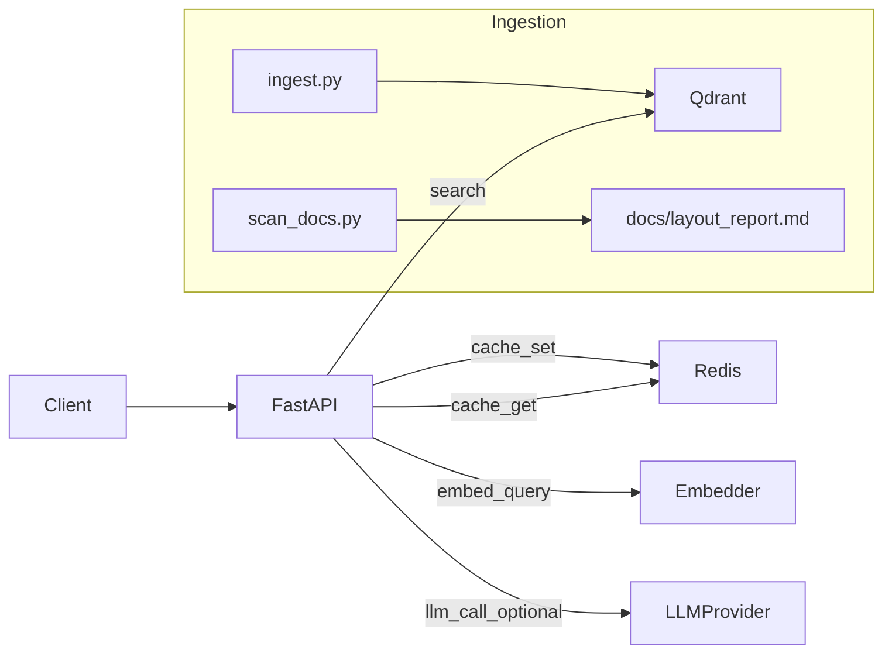

## Escopo e premissas (R1)

- **Objetivo**: MVP RAG avaliável com **recusa quando não há evidência** e **priorização de fontes confiáveis/mais recentes**.
- **Docs locais**: usar [`C:\Projetos\teste-overlabs\DOC-IA`](C:\Projetos\teste-overlabs\DOC-IA) montado no container como `/docs` via `DOCS_ROOT=/docs`.
- **Formato dos docs observados**:
  - `Policy/Manual`: ex. `política_reembolso_v3` tem **título + data** e enunciados curtos; `manual_financeiro` explicita regra “**em caso de conflito, usar política mais recente**”.
  - `FAQ`: `faq_reembolso_antigo` usa `Pergunta:` / `Resposta:`.
  - `Procedimento`: `procedimento_aprovacao` é curto e diretivo.
  - `Comunicado/Ata`: `comunicado_2021` diz que **não reflete políticas atuais**; `ata_reuniao` é deliberativo (“sem decisão final”).
  - **PII**: `funcionarios.txt` contém CPF e deve ser **excluído da ingestão R1**.

## Arquitetura (alto nível)

- **API** (`/backend`): FastAPI.
- **Vector DB**: Qdrant (collection `docs_chunks`).
- **Cache + rate limit**: Redis.
- **Ingestão**: scripts Python dentro de `/backend/scripts`.

## Estrutura do repositório

- `docker-compose.yml`
- `backend/Dockerfile`
- `backend/requirements.txt`
- `backend/app/`
  - `main.py` (rotas `/ask`, `/healthz`, `/readyz`, `/metrics`, middlewares)
  - `config.py` (envs: QDRANT_URL, REDIS_URL, DOCS_ROOT, OTEL_*, etc.)
  - `schemas.py` (Pydantic: request/response + validações)
  - `security.py` (guardrails: injection + sensível + validação extra)
  - `cache.py` (Redis cache sha256 + rate limit)
  - `retrieval.py` (embeddings, busca Qdrant, score final)
  - `quality.py` (4 mecanismos: threshold, cross-check, conflito, pós-validador)
  - `llm.py` (interface `LLMProvider`: OpenAI ou Stub)
  - `observability.py` (structlog JSON + request_id + métricas + OTEL opcional)
- `backend/scripts/`
  - `scan_docs.py` (deep-dive e geração do relatório)
  - `ingest.py` (chunking, metadados, embeddings e upsert)
- `docs/architecture.md`
- `docs/layout_report.md` (gerado pelo scan; manter template inicial)
- `README.md`
- `.env.example`

## Implementação do pipeline `/ask`

- **Entrada/Saída**: implementar exatamente o contrato.
  - `POST /ask` input: `{ "question": "..." }`
  - output: `{ "answer": "...", "confidence": 0..1, "sources": [{"document":"...","excerpt":"..."}] }`
  - **Sempre HTTP 200**, inclusive recusa.
- **Validação (Pydantic)**:
  - `question`: min 3, max 2000, sem caracteres de controle.
- **Guardrails (antes de cache e retrieval)**:
  - **Prompt injection**: regex + heurísticas (ex.: “ignore previous”, “system prompt”, “reveal”, “developer message”, “jailbreak”, “BEGIN/END”, etc.).
  - **Sensível/PII**: regex CPF, cartão, senha, token, API key, private key, banco/conta.
  - Se detectar: **recusar** com mensagem neutra.
- **Normalização**: trim + lower + colapsar whitespace.
- **Cache Redis**:
  - key = `sha256(normalized_question)`; TTL 600s.
  - Em hit: retornar e registrar `cache_hit=true`.
- **Retrieval (Qdrant)**:
  - embedding da pergunta (default local `sentence-transformers/all-MiniLM-L6-v2`; opcional OpenAI se `USE_OPENAI_EMBEDDINGS=1` e `OPENAI_API_KEY`).
  - `top_k=8`.
  - score final: `0.55*similarity + 0.30*trust_score + 0.15*freshness_score`.
  - limitar evidências para ~2500–3000 tokens (aprox. por contagem de palavras/char fallback se necessário).
- **Detecção de conflito**:
  - comparar top 3–5 trechos e detectar divergências simples (números, prazos em dias, datas) via regex.
  - resolver por maior `trust_score` e mais recente; se persistir ambiguidade => recusar.
- **LLM**:
  - `LLMProvider` com:
    - **OpenAI** (se `OPENAI_API_KEY` existir)
    - **Stub** (sem key): **sempre recusa** com confidence baixa.
  - prompt rígido: **somente com base nos trechos**; JSON estrito: `answer`, `confidence_hint`, `used_sources_indices`.
- **Confidence**:
  - heurística: `(avg similarity top3)*0.6 + (avg trust)*0.4`.
  - penalizar conflito.
  - combinar com hint do LLM (70% heurística / 30% hint).
- **Qualidade (4 mecanismos)** em `quality.py`:
  - A) threshold: `confidence < 0.65` => recusa
  - B) validação cruzada: 2 fontes concordam OU 1 fonte POLICY/MANUAL com trust>=0.85 sem conflito
  - C) conflito não resolvido => recusa
  - D) pós-validador: se resposta contém claim não suportado (checar presença de números/entidades mencionadas nos trechos), recusa

## Ingestão e relatório (scan + chunking)

- `scripts/scan_docs.py`:
  - varrer `DOCS_ROOT` recursivo.
  - detectar extensões, tamanhos, encoding provável, padrões: headings (título/datas), `Pergunta:/Resposta:`, separadores (`----`, `====`), listas, pipes `|`.
  - classificar `layout_type` em L1–L4.
  - gerar [`docs/layout_report.md`](docs/layout_report.md) com inventário (top 50 por tamanho), distribuição por extensão, padrões com exemplos (máx 10 linhas), e recomendação de chunking.
- `scripts/ingest.py`:
  - ingerir **somente** `.txt`/`.md`.
  - **excluir R1**: qualquer arquivo cujo path/nome contenha `funcionarios` e/ou contenha CPF (regex) — registrar no relatório/console como “ignorado por conter PII”.
  - metadados: `doc_id` (hash path), `title` (primeiro heading/título ou filename), `path` relativo, `updated_at` (mtime), `doc_type` (policy/manual/faq/process/general), `trust_score` (0.9/0.8/0.7/0.6), `freshness_score` (normalizado por recência).
  - chunking:
    - split por headings/separadores (regex: `^#`, títulos em caixa alta, `={3,}`, `-{3,}`; e blocos Q/A).
    - alvo ~650 tokens; overlap 120; prefixar cada chunk com `Título/Seção`.
  - upsert Qdrant em `docs_chunks` com payload completo e vetor embedding.

## Observabilidade, resiliência e segurança

- **Logs JSON** (structlog): `request_id`, `latency_ms`, `cache_hit`, `top_docs` (paths + scores), `refusal_reason`.
- **Métricas** em `/metrics` (Prometheus): `request_count`, `request_latency`, `cache_hit_count`, `refusal_count`, `llm_errors`.
- **OpenTelemetry** opcional por env (não quebrar sem collector).
- **Timeouts**: Redis/Qdrant + LLM (15s).
- **Resiliência**:
  - Qdrant down: `/readyz` falha; `/ask` **recusa padrão** (não 500).
- **Rate limit**: middleware simples por IP (Redis), ex. 60 req/min.

## Docker Compose

- `api` (FastAPI: 8000), `qdrant` (6333), `redis` (6379).
- volumes:
  - montar `DOC-IA` do host em `/docs`.
  - persistir `qdrant_storage`.

## Documentação

- [`README.md`](README.md):
  - arquitetura + diagrama, como rodar (`docker compose up --build`), como scan/ingest, exemplos `curl` (resposta e recusa), critérios de recusa, qualidade (4 itens), custo/cache, monitoramento, segurança, limitações.
  - **Roadmap R2**: docs por funcionário com RBAC/ABAC, PII masking, audit logs, filtros no Qdrant, retenção e criptografia.
- [`docs/architecture.md`](docs/architecture.md) detalhando componentes e fluxo.
- [`docs/layout_report.md`](docs/layout_report.md) template inicial + gerado pelo scan.

## Verificações finais (antes de entregar)

- `docker compose up --build` sobe `api/qdrant/redis`.
- `/healthz` ok.
- `/readyz` checa conexões.
- Rodar `python backend/scripts/scan_docs.py` (gera relatório).
- Rodar `python backend/scripts/ingest.py` (cria coleção e indexa; ignora PII).
- `POST /ask`:
  - com evidência forte (ex.: prazo de reembolso nacional) retorna resposta baseada em `política_reembolso_v3`.
  - com conflito/ambiguidade (ex.: “qual prazo de reembolso?” sem especificar nacional/internacional) tende a recusar ou pedir evidência suficiente via regras.
  - perguntas sensíveis (ex.: CPF de alguém) recusa.