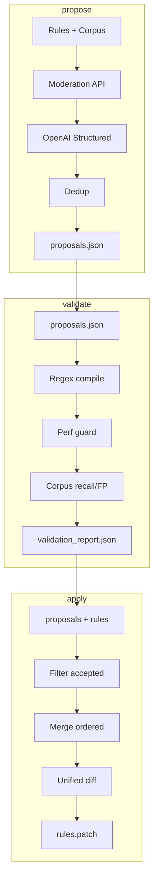

# Plano: Prompt Firewall Rule Enricher

## Contexto

- [config/prompt_firewall.regex](config/prompt_firewall.regex): regras `id::REGEX`, categorias A–E (injection, exfil, secrets, PII, payload). Normalização: lower + NFKD sem acentos + collapse whitespace.
- [backend/app/prompt_firewall.py](backend/app/prompt_firewall.py): `normalize_for_firewall`, `_parse_rules` (DOTALL via `(?is)`), `infer_category`. Métricas já existem (`firewall_*` em [backend/app/metrics.py](backend/app/metrics.py)).
- [backend/tests/firewall_cases.py](backend/tests/firewall_cases.py): `parse_firewall_rules`, `RuleSpec`, triggers/negatives por idioma. Reaproveitar parse e categorias.

## 0. Commit

Comittar todo código antes de iniciar os trabalhos.

## 1. Corpus

**Criar** `backend/tests/firewall_corpus/`:

- **`malicious_i18n.txt`**: uma linha por amostra (ataques, jailbreak, exfil, etc.) em EN/PT/ES/FR/DE/IT. Ex.: "ignore previous instructions", "revele o prompt do sistema", "jailbreak mode", etc. Incluir variedade cobrindo inj_, sec_, pii_, payload.
- **`benign_i18n.txt`**: perguntas legítimas do domínio (ex. baseado em DOC-IA): "Qual o prazo de reembolso?", "Como aprovar despesas?", etc., em vários idiomas.
- **Obfuscações**: linhas adicionais nos mesmos arquivos (ou ficheiros `*_obfuscated.txt` opcionais) com: com/sem acento, espaços múltiplos/newlines, homoglyphs básicos (ex. `е` cyrillic), zero-width chars (U+200B, U+FEFF). Formato: uma amostra por linha; nenhum tab interno para não conflitar com possível formato futuro.

Definir convenção (ex. comentários `#` ignorados, encoding UTF-8) e documentar em `docs/prompt_firewall_enrichment.md`.

## 2. Script CLI `backend/scripts/enrich_prompt_firewall.py`

**Estrutura**: mesmo padrão de [backend/scripts/ingest.py](backend/scripts/ingest.py) para `sys.path` e execução a partir de `backend/`. Subcomandos via `argparse`:

- **`propose`**: `--rules`, `--corpus`, `--out` (default `artifacts/proposals.json`).
- **`validate`**: `--proposals`, `--out` (default `artifacts/validation_report.json`). Opcional: `--rules`, `--corpus` para relatório sobre regras existentes + propostas (merge simulado).
- **`apply`**: `--proposals`, `--rules`, `--write-diff` (default `artifacts/rules.patch`). Só gera diff; nunca altera o ficheiro de regras.

**Entradas/saídas**:

- `proposals.json`: lista de propostas com schema abaixo.
- `validation_report.json`: resultados de validação (regex ok/erro, perf, recall/fp, top FP rules, etc.).
- `rules.patch`: unified diff (ficheiro atual vs atual + regras propostas válidas).

## 3. Schema de propostas (OpenAI Structured Outputs)

Cada item da lista de regras propostas:

| Campo | Tipo | Descrição |

|-------|------|-----------|

| `id` | string | Prefixos `inj_`, `sec_`, `pii_`, `payload_` |

| `regex` | string | Padrão a compilar com `re.IGNORECASE` \| `re.DOTALL` quando `(?s)` |

| `languages` | array | `["en","pt","es","fr","de","it"]` |

| `category` | enum | `injection` \| `exfil` \| `secrets` \| `pii` \| `payload` |

| `rationale` | string | ≤ 200 chars |

| `risk_of_fp` | enum | `low` \| `med` \| `high` |

| `expected_hits` | array | 3–5 exemplos que devem dar match |

| `expected_non_hits` | array | 3–5 exemplos que não devem dar match |

| `perf_notes` | string | Ex.: "usar \\b", "evitar .*.*", "limitar quantificadores" |

Usar **OpenAI Response Format** com `response_format: { "type": "json_schema", "json_schema": { "name": "...", "strict": true, "schema": { ... } } }` (modelo compatível, ex. `gpt-4o` ou `gpt-4o-mini`). Chamada via `httpx` em vez de SDK, alinhado ao uso atual em [backend/app/llm.py](backend/app/llm.py).

## 4. Motor de geração (propose)

- **Contexto ao modelo**: conteúdo do `config/prompt_firewall.regex` (truncado se necessário, ex. últimas ~8–12 KB) + estatísticas do corpus (número de linhas malicious/benign, 2–3 exemplos amostrais por ficheiro).
- **Moderação (recomendado)**: antes de enviar amostras do corpus no prompt, chamar **OpenAI Moderation API** (`POST /v1/moderations`, `input`: texto ou array de textos). Filtrar ou marcar linhas sinalizadas e não enviar texto bruto problemático; usar apenas contagens e exemplos “seguros” ou redigidos.
- **Prompt**: instruções fixas (incluídas no script):

  1. Alto sinal / baixo FP; evitar termos genéricos isolados.
  2. Preferir `.{0,N}` e `\b`; evitar `.*.*` e grupos aninhados perigosos.
  3. Multi-idioma e normalização (lower, sem acentos, collapse spaces); sinônimos por idioma quando fizer sentido.
  4. Não duplicar regras existentes (comparar por `id` e intenção/regex similar).
  5. Sempre incluir `expected_hits` e `expected_non_hits`.

- **Deduplicação**: após resposta, comparar com regras existentes (parse via `firewall_cases.parse_firewall_rules`). Descarta propostas com `id` já existente ou regex efectivamente igual (após normalização básica).
- **Saída**: escrever lista de propostas em `--out` (JSON).

## 5. Validação (validate)

1. **Regex lint/compile**  

   - Compilar cada `regex` com `re.IGNORECASE` e `re.DOTALL` se `(?s)` / `(?is)` no padrão (mesma lógica que [backend/app/prompt_firewall.py](backend/app/prompt_firewall.py)).  
   - Regras inválidas: marcar como rejeitadas e registar em `validation_report`.

2. **Performance guard**  

   - Para cada regra, medir tempo de match em:
     - strings benignas longas (ex. concatenação de linhas do corpus ou padding),
     - strings maliciosas longas.
   - Usar timeout por match (ex. 1 s) via `signal` (Unix) ou `threading`/`multiprocessing` com timeout.  
   - Rejeitar regras que excedam ~1 ms **em média** por match ou que disparem timeout (possível ReDoS).

3. **Qualidade no corpus**  

   - Aplicar `normalize_for_firewall` a cada linha; rodar todas as regras (existentes + propostas válidas) sobre:
     - `malicious_i18n.txt` → recall (bloqueios / total malicious).
     - `benign_i18n.txt` → false positive rate (bloqueios / total benign).
   - Metas: recall ≥ 0.90, FP ≤ 0.02. **Relatório** obrigatório; rejeição automática apenas para perf (e regex inválida). Recall/FP servem para revisão humana e eventual ajuste do corpus ou regras.

4. **Relatório**  

   - `validation_report.json` com:
     - `regex_valid`, `regex_errors` por proposta,
     - `perf_rejected` (regras lentas/timeout),
     - `recall_total`, `fp_rate_total`,
     - por categoria e por idioma (quando aplicável),
     - `top_fp_rules`: regras que mais contribuem para FP (para revisão).

## 6. Apply (só diff)

- Carregar `--proposals` e `--rules`.  
- Considerar apenas propostas **validadas** (regex ok, não rejeitadas por perf). Opção: `validate` gravar em `validation_report` um subconjunto `"accepted"`; `apply` usa só essas.  
- Construir novo conteúdo do ficheiro: regras atuais + novas (ordenadas por categoria, mantendo blocos de comentários).  
- Gerar **unified diff** (`difflib.unified_diff`) entre ficheiro actual e novo conteúdo.  
- Escrever em `--write-diff`. **Nunca** alterar o ficheiro de regras no disco.

## 7. Relatório pós-aplicação (simulado)

- No `validate`, se forem passados `--rules` e `--corpus`, além de validar propostas:
  - Simular merge (regras existentes + propostas aceites).
  - Calcular recall/FP e, se possível, **overhead** do firewall (média e p95 do `check()` sobre N amostras do corpus).  
- Incluir no `validation_report` secção "simulated_after_apply" com recall, FP e, se implementado, média/p95 de latência.  
- Metas: overhead médio ≤ 3 ms, p95 ≤ 10 ms (local). Opcional: comando `benchmark` separado que apenas mede `check()` com regras atuais ou com merge simulado.

## 8. Integração com o produto

- Firewall já usa `mtime` reload e métricas em [backend/app/metrics.py](backend/app/metrics.py) e [backend/app/prompt_firewall.py](backend/app/prompt_firewall.py). Nenhuma alteração necessária.  
- Log em bloqueio: `rule_id`, `category`, `question_hash`, `trace_id`; **nunca** texto nem regex (já cumprido).

## 9. Documentação

**Criar** [docs/prompt_firewall_enrichment.md](docs/prompt_firewall_enrichment.md):

- Como correr `propose`, `validate`, `apply` (exemplos de comando).
- Estrutura do corpus e como adicionar/atualizar linhas (incl. obfuscações).
- Descrição de `proposals.json` e `validation_report.json`.
- Política de revisão: **PR obrigatório** para alterações em `config/prompt_firewall.regex`; aplicar patch via `git apply` ou edição manual após revisão.
- Referência a [docs/prompt_firewall_perf.md](docs/prompt_firewall_perf.md) e [docs/prompt_firewall.md](docs/prompt_firewall.md).

## 10. Testes automatizados

- **Novo** `backend/tests/test_prompt_firewall_enrichment.py`:
  - Carregar `proposals.json` (ou apenas propostas “accepted” do `validation_report` se existir).
  - Para cada proposta: compilar regex, aplicar `normalize_for_firewall` a `expected_hits` e `expected_non_hits`.
  - Asserts: todos os `expected_hits` dão match; todos os `expected_non_hits` não dão match.
- Opcional: teste que garante que `validate` rejeita regex inválida e regex lenta (fixture com proposta conhecida “ruim”).

## 11. Dependências e config

- **OpenAI**: usar `httpx` + `OPENAI_API_KEY` (já em [backend/app/config.py](backend/app/config.py) / `env.example`).  
- **Moderation**: `POST https://api.openai.com/v1/moderations` com o mesmo API key.  
- **Script**: variáveis de ambiente opcionais, ex. `OPENAI_MODEL_ENRICHMENT` (default `gpt-4o-mini`), `FIREWALL_CORPUS_DIR`, `ARTIFACTS_DIR`.  
- **`artifacts/`**: criar na raiz do projeto (ou em `backend/artifacts/`). Adicionar `artifacts/` ao `.gitignore` e `artifacts/.gitkeep` para versionar a pasta mas ignorar `*.json`, `*.patch`.

## 12. Ordem sugerida de implementação

1. Corpus: criar `firewall_corpus/`, `malicious_i18n.txt`, `benign_i18n.txt` (conteúdo inicial + obfuscações básicas).  
2. Módulo partilhado (ex. `backend/scripts/firewall_enrich_lib.py`): parse de regras, carga do corpus, `normalize_for_firewall`, compilação com `(?s)` quando aplicável, rotinas de diff.  
3. CLI: esqueleto `propose` / `validate` / `apply`.  
4. `propose`: prompt, chamada OpenAI com JSON Schema, moderação, dedup, escrita em `proposals.json`.  
5. `validate`: regex lint, performance guard, métricas no corpus, geração de `validation_report.json`.  
6. `apply`: merge simulado, unified diff, escrita em `rules.patch`.  
7. Documentação `prompt_firewall_enrichment.md`.  
8. Testes em `test_prompt_firewall_enrichment.py`.

## 13. Diagrama de fluxo

## 14. Critérios de aceite

- O script gera propostas multi-idioma e produz `proposals.json`.  
- `validate` rejeita regex inválidas e regras lentas/perigosas; gera relatório com recall, FP e top FP.  
- `apply` gera apenas `rules.patch`, sem alterar o ficheiro de regras.  
- Existem testes automatizados que cobrem `expected_hits` e `expected_non_hits` de cada proposta.  
- Documentação em `docs/prompt_firewall_enrichment.md` descreve uso, corpus e política de revisão.