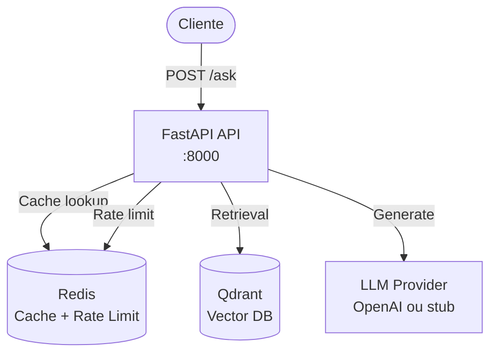

# teste-overlabs - Sistema RAG com Recusa Inteligente

> **⚠️ Aviso de Confidencialidade**: Este repositório é confidencial e destinado apenas para fins de avaliação. Veja [CONFIDENTIALITY.md](CONFIDENTIALITY.md) para detalhes.

Sistema RAG que responde perguntas sobre documentos internos com **recusa quando não há evidência suficiente**, priorizando documentos mais confiáveis e mais recentes.

### Titularidade e Contato
**Titular/Mantenedor:** Leopoldo Carvalho Correia de Lima  
**Contato:** leopoldo.de.lima@gmail.com  
**Copyright:** © 2026 Leopoldo Carvalho Correia de Lima. Todos os direitos reservados.

---

## O que este sistema resolve

Em sistemas RAG, é crítico **não inventar respostas** quando não há evidência suficiente ou quando há conflitos entre documentos. Este sistema implementa:

1. **Recusa inteligente**: Retorna mensagem padrão quando não há base suficiente, em vez de gerar resposta incorreta
2. **Priorização de fontes**: Usa documentos mais confiáveis (`trust_score`) e mais recentes (`freshness_score`) para reduzir erros
3. **Detecção de conflitos**: Identifica quando documentos conflitam (ex.: prazos diferentes) e recusa se não conseguir resolver

**Implementação**: [`backend/app/main.py`](backend/app/main.py) (linhas 140-1071), [`backend/app/quality.py`](backend/app/quality.py)

---

## Arquitetura



**Componentes**:
1. **FastAPI** (`backend/app/main.py`): Endpoint `/ask`, validação, guardrails, cache, retrieval, LLM, qualidade
2. **Qdrant** (`backend/app/retrieval.py`): Vector database, coleção `docs_chunks`, busca por similaridade
3. **Redis** (`backend/app/cache.py`): Cache de respostas (SHA256 da pergunta) e rate limiting por IP
4. **LLM** (`backend/app/llm.py`): OpenAI (se `OPENAI_API_KEY` configurada) ou stub determinístico
5. **Embeddings** (`backend/app/retrieval.py`): fastembed local (ONNX) ou OpenAI embeddings

**Deploy**: Docker Compose local ou Azure Container Apps (ver [Como rodar](#como-rodar))

---

## Endpoint principal: POST /ask

**Request**:
```json
{
  "question": "Qual o prazo para reembolso de despesas nacionais?"
}
```

**Validação**: 3-2000 caracteres, sem caracteres de controle. Implementado em [`backend/app/schemas.py`](backend/app/schemas.py) (linhas 12-20).

**Response** (sucesso):
```json
{
  "answer": "O prazo para reembolso de despesas nacionais é de 30 dias corridos...",
  "confidence": 0.85,
  "sources": [
    {
      "document": "politica-reembolso-v3.txt",
      "excerpt": "Prazo de reembolso: 30 dias corridos para despesas nacionais..."
    }
  ]
}
```

**Response** (recusa):
```json
{
  "answer": "Não encontrei informações confiáveis para responder essa pergunta.",
  "confidence": 0.2,
  "sources": []
}
```

**Headers de resposta**:
- `X-Answer-Source`: `CACHE`, `LLM`, ou `REFUSAL`
- `X-Trace-ID`: ID único do trace (correlaciona com audit)
- `X-Chat-Session-ID`: ID da sessão (persistido entre requests)

**Código**: [`backend/app/main.py`](backend/app/main.py) (linha 140)

---

## Como decide responder vs recusar

O sistema aplica **4 controles de qualidade** em sequência:

### 1. Threshold de confiança
**Regra**: Se `confidence < 0.65`, recusa.

**Implementação**: [`backend/app/quality.py`](backend/app/quality.py) (linha 105-106)
```python
def quality_threshold(confidence: float, threshold: float = 0.65) -> bool:
    return confidence >= threshold
```

**Uso**: [`backend/app/main.py`](backend/app/main.py) (linha 850)

### 2. Validação cruzada (cross-check)
**Regra**: Responde apenas se:
- **2+ fontes distintas concordam**, OU
- **1 fonte POLICY/MANUAL com `trust_score >= 0.85`** e sem conflito

**Implementação**: [`backend/app/quality.py`](backend/app/quality.py) (linhas 109-128)
```python
def cross_check_ok(doc_types, doc_paths, trust_scores, conflict) -> bool:
    if conflict.has_conflict:
        return False
    distinct_docs = {p for p in doc_paths if p}
    if len(distinct_docs) >= 2:
        return True
    if len(doc_types) == 1:
        dt = (doc_types[0] or "").upper()
        trust = trust_scores[0] if trust_scores else 0.0
        if dt in {"POLICY", "MANUAL"} and trust >= 0.85:
            return True
    return False
```

**Uso**: [`backend/app/main.py`](backend/app/main.py) (linha 860)

### 3. Detecção de conflitos
**Regra**: Se há conflito irresolúvel (ex.: prazos diferentes no mesmo escopo), recusa.

**Implementação**: [`backend/app/quality.py`](backend/app/quality.py) (linhas 22-82)
- Detecta prazos em dias e datas `dd/mm/yyyy` por escopo (nacional/internacional/geral)
- Se pergunta especifica escopo, só considera sentenças desse escopo
- Conflito = mais de um valor diferente no mesmo escopo

**Uso**: [`backend/app/main.py`](backend/app/main.py) (linha 810)

### 4. Pós-validação
**Regra**: Números citados na resposta devem existir nos trechos de evidência.

**Implementação**: [`backend/app/quality.py`](backend/app/quality.py) (linhas 130-136)
```python
def post_validate_answer(answer: str, evidence_text: str) -> bool:
    answer_nums = set(_NUM_RE.findall(answer))
    if not answer_nums:
        return True
    ev_nums = set(_NUM_RE.findall(evidence_text))
    return answer_nums.issubset(ev_nums)
```

**Uso**: [`backend/app/main.py`](backend/app/main.py) (linha 870)

**Fluxo completo**: [`backend/app/main.py`](backend/app/main.py) (linhas 800-890)

---

## Como trata documentos conflitantes

### Priorização
1. **Re-rank por score combinado**: `final_score = (similarity * 0.6) + (trust_score * 0.4) + (freshness_score * 0.2)`
2. **Seleção de evidência**: Limita tokens e seleciona top chunks por `final_score`

**Implementação**: [`backend/app/retrieval.py`](backend/app/retrieval.py) (função `select_evidence`)

### Resolução de conflitos
1. **Detecção por escopo**: Nacional, internacional ou geral
2. **Filtro por pergunta**: Se pergunta menciona "nacional", só considera sentenças nacionais
3. **Conflito = múltiplos valores no mesmo escopo**: Ex.: "10 dias" e "30 dias" ambos para "nacional"

**Implementação**: [`backend/app/quality.py`](backend/app/quality.py) (linhas 22-82)

### Quando recusa
- Conflito detectado E não consegue resolver (ex.: 2 valores diferentes no mesmo escopo)
- Aplicado antes do LLM: [`backend/app/main.py`](backend/app/main.py) (linha 810)

---

## Controles de qualidade

### 1. Threshold de confiança
- **Onde**: [`backend/app/quality.py`](backend/app/quality.py) (linha 105)
- **Threshold**: 0.65 (configurável)
- **Quando aplica**: Após LLM gerar resposta

### 2. Cross-check (validação cruzada)
- **Onde**: [`backend/app/quality.py`](backend/app/quality.py) (linha 109)
- **Regra**: 2+ fontes OU 1 fonte POLICY/MANUAL com trust >= 0.85
- **Quando aplica**: Após threshold, antes de retornar

### 3. Detecção de conflitos
- **Onde**: [`backend/app/quality.py`](backend/app/quality.py) (linha 22)
- **Escopos**: Nacional, internacional, geral
- **Quando aplica**: Antes do LLM, após retrieval

### 4. Pós-validação
- **Onde**: [`backend/app/quality.py`](backend/app/quality.py) (linha 130)
- **Regra**: Números na resposta devem existir na evidência
- **Quando aplica**: Após LLM, antes de retornar

**Documentação detalhada**: [docs/quality-controls.md](docs/quality-controls.md)

---

## Custo, performance e resiliência

### Cache
- **Onde**: [`backend/app/cache.py`](backend/app/cache.py) (linhas 12-37)
- **Chave**: SHA256 da pergunta normalizada (strip, lower, collapse whitespace)
- **TTL**: 600 segundos (10 minutos), configurável via `CACHE_TTL_SECONDS`
- **Redução de custo**: Evita chamadas ao LLM e Qdrant para perguntas repetidas

**Uso**: [`backend/app/main.py`](backend/app/main.py) (linha 380)

### Rate limiting
- **Onde**: [`backend/app/cache.py`](backend/app/cache.py) (linhas 39-50)
- **Limite**: 60 requests/minuto por IP (configurável via `RATE_LIMIT_PER_MINUTE`)
- **Chave**: `rl:<ip>:<epochMinute>`
- **Redução de custo**: Limita abuso e chamadas desnecessárias

**Uso**: [`backend/app/main.py`](backend/app/main.py) (linha 274)

### Resiliência
- **Qdrant/Redis indisponíveis**: `/readyz` retorna 503, mas `/ask` não quebra (retorna recusa padrão)
- **Timeout Redis**: 1 segundo (socket_timeout), falha silenciosa
- **Fallback LLM**: Se `OPENAI_API_KEY` não configurada, usa stub determinístico

**Implementação**: [`backend/app/cache.py`](backend/app/cache.py) (linha 25), [`backend/app/main.py`](backend/app/main.py) (linha 118-134)

**Documentação detalhada**: [docs/cost-performance.md](docs/cost-performance.md)

---

## Segurança

### Validação de input
- **Onde**: [`backend/app/schemas.py`](backend/app/schemas.py) (linhas 12-20)
- **Regras**: 3-2000 caracteres, sem caracteres de controle
- **Validação**: Pydantic com `field_validator`

### Detecção de prompt injection
- **Onde**: [`backend/app/security.py`](backend/app/security.py) (linhas 59-76)
- **Método**: Regex heurística (fallback quando Prompt Firewall desabilitado)
- **Padrões**: "ignore previous instructions", "reveal system prompt", "jailbreak", etc.

**Uso**: [`backend/app/main.py`](backend/app/main.py) (linha 350) - apenas quando Prompt Firewall está disabled

### Bloqueio de perguntas sensíveis
- **Onde**: [`backend/app/security.py`](backend/app/security.py) (linha 79)
- **Detecta**: CPF, números de cartão, palavras-chave de segredos
- **Ação**: Recusa imediata, sem chamar retriever/LLM

**Uso**: [`backend/app/main.py`](backend/app/main.py) (linha 360)

**Documentação detalhada**: [docs/security.md](docs/security.md)

---

## Como rodar

### Local (Docker Compose)

1. **Configurar**:
   ```bash
   cp env.example .env
   # Editar DOCS_HOST_PATH apontando para pasta de documentos
   ```

2. **Subir stack**:
   ```bash
   docker compose up --build
   ```

3. **Indexar documentos**:
   ```bash
   docker compose exec api python -m scripts.scan_docs
   docker compose exec api python -m scripts.ingest
   ```

4. **Testar**:
   ```bash
   curl -X POST http://localhost:8000/ask \
     -H "Content-Type: application/json" \
     -d '{"question": "Qual o prazo para reembolso?"}'
   ```

**Acesse**: http://localhost:8000/docs (Swagger UI)

**Parar containers**:
```bash
# Windows
.\infra\stop_all.ps1

# Linux/Mac
./infra/stop_all.sh
```

### Cloud (Azure Container Apps)

**URL de produção**: `https://<fqdn-do-container-app>/ask`

**Testar**:
```bash
curl -X POST https://<fqdn>/ask \
  -H "Content-Type: application/json" \
  -d '{"question": "Qual o prazo para reembolso?"}'
```

**Deploy**: Ver [docs/deployment_azure.md](docs/deployment_azure.md)

---

## Trade-offs e limitações

### Trade-offs
- **Recusa conservadora**: Pode recusar perguntas válidas se evidência não for suficiente (threshold 0.65)
- **Conflitos apenas prazos/datas**: Não detecta outros tipos de conflito (ex.: valores monetários diferentes)
- **Cache sem invalidação**: Cache expira apenas por TTL, não invalida quando documentos mudam
- **Rate limit simples**: Janela fixa por minuto, pode permitir bursts no início do minuto

### Limitações
- **Sem frontend**: Apenas API REST
- **Ingestão manual**: Documentos devem ser indexados via script (`scripts/ingest.py`)
- **Embeddings locais limitados**: fastembed usa modelo pequeno (all-MiniLM-L6-v2), pode ter qualidade inferior a OpenAI
- **Stub LLM**: Sem `OPENAI_API_KEY`, usa stub determinístico (não gera respostas reais)

**Melhorias sugeridas**: Ver issues no repositório (se aplicável)

---

## Documentação detalhada

- **[Arquitetura](docs/architecture.md)**: Diagramas e componentes
- **[Controles de Qualidade](docs/quality-controls.md)**: Threshold, cross-check, conflitos, pós-validação
- **[Segurança](docs/security.md)**: Validação, prompt injection, bloqueio sensível
- **[Custo e Performance](docs/cost-performance.md)**: Cache, rate limiting, resiliência

---

## Links úteis

- [FastAPI Documentation](https://fastapi.tiangolo.com/)
- [Qdrant Documentation](https://qdrant.tech/documentation/)
- [Azure Container Apps](https://learn.microsoft.com/azure/container-apps/)
