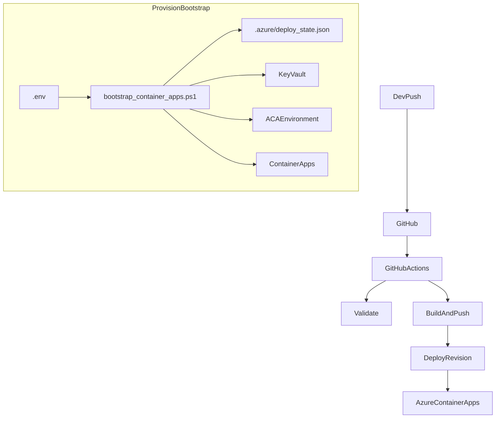

# Metodologia de Deploy (Azure Container Apps)

Este documento descreve **como este repositório opera o deploy** em Azure Container Apps (ACA), quais são as **fontes de verdade**, e os **padrões de hardening** (especialmente para Key Vault).

## Fonte de verdade (por camada)

- **Infra (provision)**:
  - **Script idempotente**: `infra/bootstrap_container_apps.ps1` (usa `.azure/deploy_state.json` como estado).
  - **IaC alternativa**: `azure/bicep/main.bicep` (infra como código; útil para revisão/replicação).
- **Deploy (rollout de imagem)**:
  - **CI/CD**: `.github/workflows/deploy-azure.yml` (build/push ACR + update do Container App).
- **Operação (runbooks e diagnósticos)**:
  - `docs/deployment_azure.md`, `azure/DEPLOYMENT.md`, `docs/runbook_incidents.md`, `docs/runbook_add_keyvault_secret.md`.

## Fluxos oficiais

### 1) Provision (bootstrap) — cria/atualiza recursos

Arquivo principal: `infra/bootstrap_container_apps.ps1`.

- Entrada: `.env` (variáveis são classificadas em **secrets** vs **non-secrets**).
- Estado: `.azure/deploy_state.json` (nomes e sufixo do ambiente).
- Cria/garante: Resource Group, ACR, Key Vault, ACA Environment, Storage Account + File Shares.
- Cria/garante apps via subscripts:
  - `infra/bootstrap_redis.ps1`
  - `infra/bootstrap_qdrant.ps1`
  - `infra/bootstrap_api.ps1`

### 2) Deploy (CI/CD) — publica nova revisão

Arquivo: `.github/workflows/deploy-azure.yml`.

- Job `validate`: exige `.azure/deploy_state.json` e roda validações (incluindo Key Vault syntax).
- Job `build`: build/push da imagem para o ACR.
- Job `deploy`: garante MI + RBAC no Key Vault e atualiza imagem do Container App.

## Padrão de Key Vault em ACA (obrigatório)

### Nunca usar sintaxe de App Service

- **Proibido** em YAML/env de ACA: `@Microsoft.KeyVault(SecretUri=...)`.
- Em ACA, a referência correta é:
  - **Secrets**: `properties.configuration.secrets[*].keyVaultUrl` + `identity`
  - **Env vars**: `secretRef` (nunca `value` com referência)

### Identity + RBAC (mínimo necessário)

- **Identity**: preferir `SystemAssigned` (UserAssigned apenas quando houver requisito explícito).
- **RBAC**: conceder ao `principalId` do Container App a role **Key Vault Secrets User** no escopo do vault.
- **Network ACL**: se o Key Vault usa firewall, garantir acesso para o runtime do ACA (conforme política da organização).

### Chicken-and-egg (2 fases)

`SystemAssigned` só existe após o create. O fluxo esperado (já aplicado em `infra/bootstrap_api.ps1`):

1. **Create** do app com identity habilitada (sem secrets KV no YAML inicial).
2. Capturar `principalId`.
3. Conceder RBAC no Key Vault.
4. Aplicar secrets (Key Vault) e env vars via `secretRef`.

## Guardrails (qualidade/safety)

- Validação automatizada: `infra/validate_keyvault_syntax.ps1` roda no CI e falha se detectar padrões proibidos em YAML/scripts.

