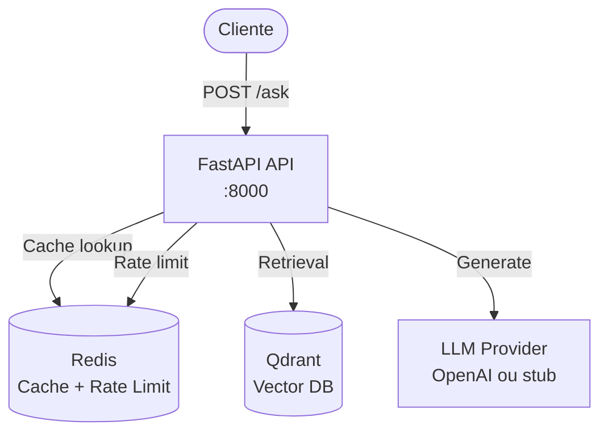

# Arquitetura

Visão técnica dos componentes e como interagem.

## Diagrama de Componentes

## Componentes

### 1. FastAPI API

**Arquivo**: [`backend/app/main.py`](backend/app/main.py)

**Responsabilidades**:
- Endpoint `/ask` (linha 140)
- Validação de input (Pydantic)
- Guardrails de segurança (linhas 274-370)
- Cache lookup (linha 380)
- Retrieval do Qdrant (linha 400)
- Geração via LLM (linha 820)
- Controles de qualidade (linhas 800-890)
- Audit logging (assíncrono)

**Endpoints**:
- `POST /ask`: Endpoint principal
- `GET /healthz`: Health check básico
- `GET /readyz`: Readiness (verifica Qdrant e Redis)
- `GET /metrics`: Métricas Prometheus
- `GET /docs`: Swagger UI

### 2. Qdrant (Vector Database)

**Arquivo**: [`backend/app/retrieval.py`](backend/app/retrieval.py) (linhas 87-252)

**Responsabilidades**:
- Armazenar embeddings de chunks de documentos
- Busca por similaridade (cosine similarity)
- Coleção: `docs_chunks` (configurável via `QDRANT_COLLECTION`)

**Configuração**:
- URL: `QDRANT_URL` (default: `http://qdrant:6333`)
- Timeout: 2.0 segundos
- Top-k: 8 chunks por busca

### 3. Redis (Cache e Rate Limiting)

**Arquivo**: [`backend/app/cache.py`](backend/app/cache.py)

**Responsabilidades**:
- Cache de respostas (TTL 10 minutos)
- Rate limiting por IP (60 req/min)

**Configuração**:
- URL: `REDIS_URL` (default: `redis://redis:6379/0`)
- Timeout: 1.0 segundo (connect e socket)

### 4. LLM Provider

**Arquivo**: [`backend/app/llm.py`](backend/app/llm.py)

**Responsabilidades**:
- Gerar respostas a partir de evidência
- OpenAI (se `OPENAI_API_KEY` configurada) ou stub determinístico

**Configuração**:
- Modelo: `OPENAI_MODEL` (default: `gpt-4o-mini`)
- Timeout: 15.0 segundos

### 5. Embeddings Provider

**Arquivo**: [`backend/app/retrieval.py`](backend/app/retrieval.py) (linhas 31-84)

**Responsabilidades**:
- Gerar embeddings de perguntas e documentos
- FastEmbed local (ONNX) ou OpenAI embeddings

**Configuração**:
- Modelo local: `sentence-transformers/all-MiniLM-L6-v2` (384 dims)
- Modelo OpenAI: `OPENAI_EMBEDDINGS_MODEL` (default: `text-embedding-3-small`)

---

## Fluxo de uma Request

**Arquivo**: [`backend/app/main.py`](backend/app/main.py) (linhas 140-1071)

1. **Validação**: FastAPI valida input (3-2000 chars, sem control chars)
2. **Rate limiting**: Verifica limite por IP (linha 274)
3. **Guardrails**: Prompt Firewall, injection, sensitive (linhas 315-360)
4. **Cache lookup**: Busca resposta cached (linha 380)
5. **Embedding**: Gera embedding da pergunta (linha 400)
6. **Retrieval**: Busca top_k=8 chunks no Qdrant (linha 400)
7. **Re-rank**: Ordena por `final_score` (similarity + trust + freshness) (linha 600)
8. **Select evidence**: Limita tokens e seleciona top chunks (linha 700)
9. **Detect conflict**: Verifica conflitos em prazos/datas (linha 810)
10. **LLM**: Gera resposta (se não houver conflito) (linha 820)
11. **Quality checks**: Threshold, cross-check, post-validate (linhas 850-870)
12. **Retorna**: Resposta ou recusa

---

## Deploy

### Local (Docker Compose)

**Arquivo**: [`docker-compose.yml`](docker-compose.yml)

- **API**: Porta 8000
- **Qdrant**: Porta 6335 (host) → 6333 (container)
- **Redis**: Porta 6379
- **Volumes**: `DOCS_HOST_PATH` → `/docs`, `qdrant_storage` para Qdrant

### Cloud (Azure Container Apps)

**Arquivo**: [`infra/bootstrap_container_apps.ps1`](infra/bootstrap_container_apps.ps1)

- **API Container App**: Ingress externo, porta 8000
- **Qdrant Container App**: Ingress interno, porta 6333
- **Redis Container App**: Ingress interno, porta 6379
- **Azure Files**: Volume persistente para Qdrant
- **Key Vault**: Secrets management (Managed Identity)

---

## Referências

- [Controles de Qualidade](quality-controls.md) - Validação de respostas
- [Segurança](security.md) - Guardrails de segurança
- [Custo e Performance](cost-performance.md) - Otimizações
