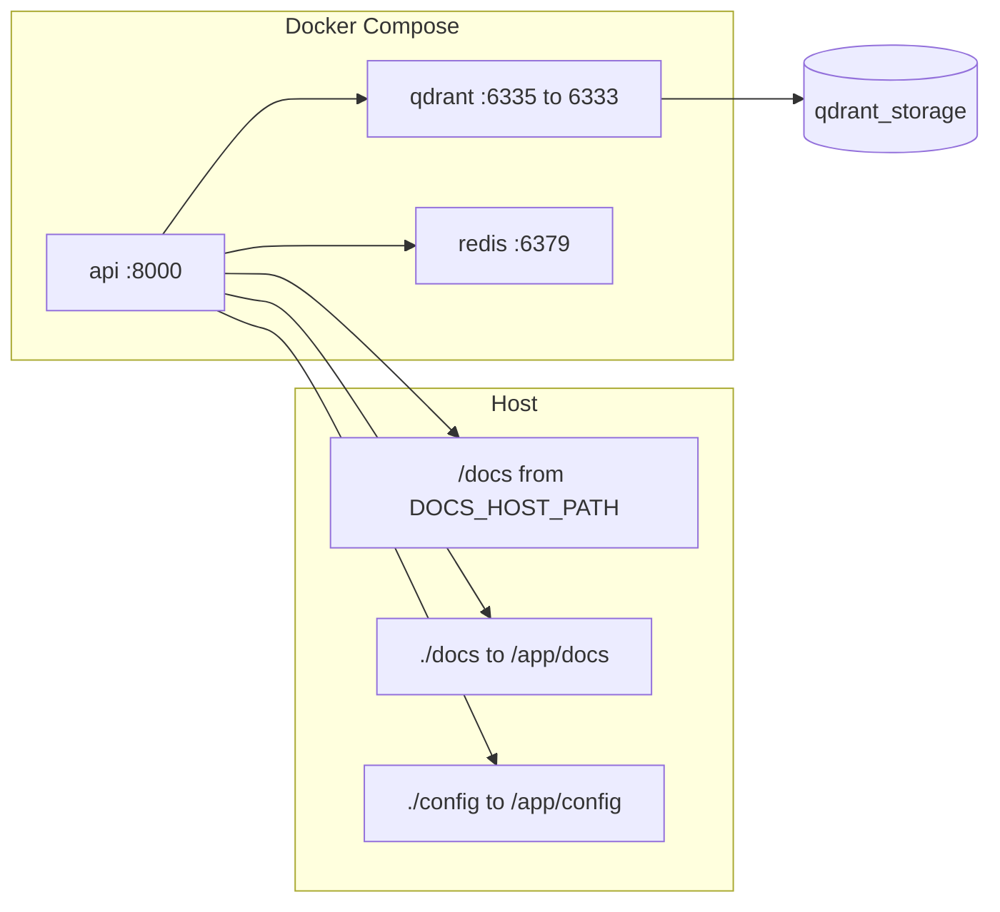

# Arquitetura e fluxos (R1)

Visão dos componentes, deployment, fluxo do `/ask`, pipeline de ingestão, decisões e mapa do código. Diagramas completos: [diagrams.md](diagrams.md).

---

## O que é

API RAG que responde perguntas sobre documentos internos: validação, guardrails, cache, retrieval (Qdrant), re-rank, conflito, LLM, qualidade. Resposta sempre 200 (inclusive recusa). Observabilidade via logs estruturados e Prometheus; OTel e audit opcionais.

---

## Contexto e containers (C4-like)

- **API:** FastAPI; expõe `/healthz`, `/readyz`, `/metrics`, `POST /ask`.
- **Redis:** Cache (SHA256 da pergunta normalizada) e rate limit (`rl:<ip>:<epochMinute>`).
- **Qdrant:** Vector DB; coleção `docs_chunks` (ou `QDRANT_COLLECTION`).
- **LLM:** OpenAI (`OPENAI_API_KEY`) ou stub sem chave.
- **MySQL:** Opcional; audit (audit_session, audit_message, audit_ask, audit_retrieval_chunk) quando `TRACE_SINK=mysql`.

---

## Deployment (Docker Compose)

- **Portas:** API 8000, Qdrant 6335→6333, Redis 6379.
- **Volumes:** `DOCS_HOST_PATH` → `/docs` (leitura); `./docs` → `/app/docs` (layout_report); `./config` → `/app/config` (regras firewall); `qdrant_storage` para Qdrant.

---

## Fluxo do `/ask` (RAG com recusa)

Ordem executada no código:

1. **Valida input** (`question` 3–2000 chars, sem caracteres de controle).
2. **Rate limit** (Redis por IP); excedido → REFUSAL.
3. **Classificação de abuso** (`abuse_classifier.classify`): calcula `risk_score` e `flags` via Prompt Firewall `scan_for_abuse()` quando habilitado + detecção local de PII/sensível. Usado para audit e decisão de criptografia raw.
4. **Prompt Firewall** (se habilitado): regras regex via `check()`; match → REFUSAL, sem retriever/LLM. Persiste `firewall_rule_ids` no audit.
5. **Guardrails fallback:** injection (regex em `security.py`) quando firewall está disabled → REFUSAL. Sensitive/PII (`security.detect_sensitive_request`) → REFUSAL. Nota: `abuse_classifier` calcula `risk_score` para audit, mas não bloqueia diretamente.
6. **Normaliza** pergunta (`security.normalize_question`: strip, lower, colapsa whitespace).
7. **Cache** Redis: key = `sha256(normalized)`; hit → 200 + `X-Answer-Source=CACHE`.
8. **Embedding** (fastembed ou OpenAI) + **Qdrant** `top_k=8`.
9. **Re-rank** (confiança/recência), **select_evidence** (limite tokens), **detecção de conflito**.
10. **Conflito** (`quality.detect_conflict`): prazos em dias e datas `dd/mm/yyyy` por escopo (nacional/internacional/geral). Conflito irresolúvel → REFUSAL.
11. **LLM** (OpenAI ou stub): refusal/vazio → REFUSAL.
12. **Qualidade:**  
    - **Threshold** de confidence (&lt; 0,65 → REFUSAL).  
    - **Cross-check** (`cross_check_ok`): 2+ fontes distintas **ou** 1 fonte POLICY/MANUAL com trust ≥ 0,85; sem conflito.  
    - **Pós-validação** (`post_validate_answer`): números citados na resposta devem existir nos trechos de evidência; caso contrário → REFUSAL.
13. **Resposta** 200; `X-Answer-Source` = CACHE | LLM | REFUSAL. Audit (session, message, ask; chunks quando há retrieval). `abuse_risk_score` e `abuse_flags_json` persistidos em `audit_ask`; `firewall_rule_ids` quando bloqueado pelo firewall.

Diagrama de sequência: [diagrams.md#c](diagrams.md#c-sequência-do-ask-detalhado).

---

## Pipeline de ingestão

1. **`scan_docs`:** Varre `DOCS_ROOT` (/docs), classifica layout (L1_POLICY, L2_FAQ, etc.), gera `layout_report.md` em `LAYOUT_REPORT_PATH` (default `/app/docs/layout_report.md` → `./docs` no host).
2. **`ingest`:** Lê os mesmos arquivos; ignora `.txt`/`.md` com CPF ou `funcionarios` no path. Chunking por headings/FAQ (~650 tokens, overlap 120); embeddings → upsert Qdrant.

Diagrama: [diagrams.md#d](diagrams.md#d-pipeline-de-ingestão).

---

## Hashing: cache vs audit

- **Hash de cache:** Normalização `security.normalize_question` (strip, lower, collapse ws) → `cache_key_for_question` = SHA256. Usado apenas para Redis (get/set de resposta).
- **Hash / fingerprint de audit:** Normalização `redaction.normalize_text` (strip, remove control chars, collapse ws; sem lower) → `sha256_text`. Usado em `audit_ask` (`question_hash`, `answer_hash`), `audit_message` e `audit_retrieval_chunk` (`text_hash`). **Distinto** do hash de cache.

---

## Decisões de projeto

| Decisão | Detalhe |
|--------|---------|
| **Recusa sem evidência** | Sem chunks relevantes, ou conflito irresolúvel, ou falha em quality (threshold, cross-check, post-validate) → REFUSAL, `sources=[]`, confidence ≤ 0,3. |
| **Prioridade confiança/recência** | Re-rank por `trust_score`, `freshness_score`, `final_score`; em conflito, escolhe o “melhor” chunk e pode ainda recusar se persistir conflito. |
| **Conflito** | Apenas prazos (dias) e datas (dd/mm/yyyy) por escopo. Números genéricos na resposta checados em `post_validate_answer`. |
| **Cache** | Key = `sha256(normalized_question)`. TTL `CACHE_TTL_SECONDS` (default 600). Sem prefixo; rate limit usa `rl:<ip>:<epochMinute>`. |
| **LLM opcional / stub** | Sem `OPENAI_API_KEY` usa stub determinístico; com chave usa `gpt-4o-mini` (ou `OPENAI_MODEL`). |
| **OTel opcional** | `OTEL_ENABLED=1` e `OTEL_EXPORTER_OTLP_ENDPOINT`; sem collector não quebra. |

---

## Observabilidade

- **Logs:** JSON (structlog); `request_id`, `trace_id`, `latency_ms`, `cache_hit`, `refusal_reason`, etc. Pipeline detalhado sob `PIPELINE_LOG_ENABLED` / `PIPELINE_LOG_INCLUDE_TEXT`.
- **Métricas:** `/metrics` Prometheus — `request_count`, `cache_hit_count`, `refusal_count`, `request_latency_seconds`, `llm_errors`, `firewall_*`. Ver [observability.md](observability.md).
- **OTel:** Spans e correlação quando habilitado.

---

## Configuração (env vars relevantes)

Apenas **nomes**; não incluir valores reais.

- `QDRANT_URL`, `QDRANT_COLLECTION`, `REDIS_URL`, `DOCS_ROOT`
- `USE_OPENAI_EMBEDDINGS`, `OPENAI_API_KEY`, `OPENAI_MODEL`, `OPENAI_EMBEDDINGS_MODEL`
- `CACHE_TTL_SECONDS`, `RATE_LIMIT_PER_MINUTE`
- `OTEL_ENABLED`, `OTEL_EXPORTER_OTLP_ENDPOINT`
- `TRACE_SINK` (noop | mysql), `MYSQL_*`
- `AUDIT_LOG_ENABLED`, `AUDIT_LOG_INCLUDE_TEXT`, `AUDIT_LOG_RAW_MODE`, `AUDIT_ENC_KEY_B64`, etc.
- `ABUSE_CLASSIFIER_ENABLED`, `ABUSE_RISK_THRESHOLD`
- `PROMPT_FIREWALL_ENABLED`, `PROMPT_FIREWALL_RULES_PATH`

---

## Como validar

- Subir stack: `docker compose up -d`; `GET /healthz`, `GET /readyz`.
- Rodar `scan_docs` + `ingest`; verificar `./docs/layout_report.md` e logs de ingest.
- `POST /ask` com pergunta válida; checar 200 e headers `X-Request-ID`, `X-Trace-ID`, `X-Answer-Source`, `X-Chat-Session-ID`; `GET /metrics`.

Ver [README](README.md) (Guia do avaliador) e [appendix_code_facts.md](appendix_code_facts.md).

---

## Limitações

- Prompt Firewall desabilitado por padrão.
- Audit MySQL requer `TRACE_SINK=mysql` e `MYSQL_*` configurados.
- OTel opcional; stub LLM sem chave para uso local.

---

## Mapa do código

| Módulo | Responsabilidade |
|--------|------------------|
| `app.main` | FastAPI, `/ask`, guardrails, firewall, cache, retrieval, LLM, quality, audit, headers |
| `app.security` | `normalize_question`, `detect_prompt_injection` (fallback quando firewall disabled), `detect_sensitive_request` |
| `app.prompt_firewall` | Regras regex, `normalize_for_firewall`, `check()` (bloqueio), `scan_for_abuse()` (classificação de risco), métricas firewall |
| `app.abuse_classifier` | `classify()` (integra Prompt Firewall quando habilitado), detecção local de PII/sensível, `should_save_raw()`, `flags_to_json()` |
| `app.cache` | `cache_key_for_question` (SHA256), Redis get/set, rate limit |
| `app.retrieval` | Embeddings, Qdrant, `select_evidence`, re-rank |
| `app.quality` | Conflito, confidence, threshold, cross-check, post-validate |
| `app.llm` | OpenAI ou stub |
| `app.audit_store` | AuditSession, AuditMessage, AuditAsk, AuditChunk; MySQL ou noop |
| `app.observability` | Middleware (X-Request-ID, X-Trace-ID), structlog, OTel |
| `app.metrics` | Prometheus |
| `scripts.scan_docs` | Layout → `layout_report.md` |
| `scripts.ingest` | Chunking, embeddings, upsert Qdrant; exclusão PII/funcionários |

Ver também [Guia do Avaliador](README.md#mapa-rápido-do-código).
