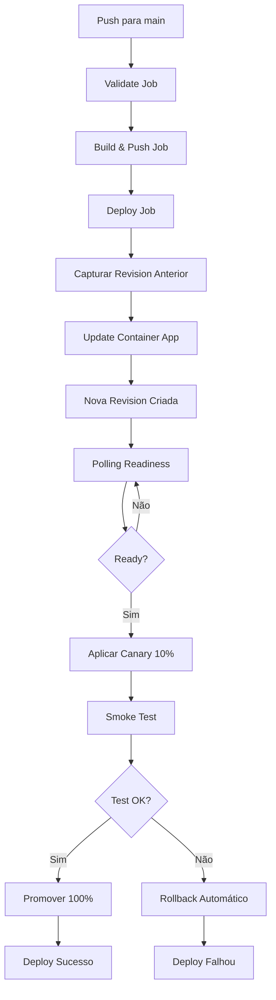

# CI/CD Pipeline - teste-overlabs

Documentação completa do pipeline de CI/CD usando GitHub Actions e Azure Container Apps.

## Visão Geral

O pipeline automatiza o processo de build, deploy e validação do sistema RAG na Azure, utilizando:

- **GitHub Actions**: Orquestração do CI/CD
- **Azure Container Apps**: Deploy com Revisions e Canary
- **Azure Container Registry (ACR)**: Armazenamento de imagens Docker
- **OIDC**: Autenticação sem secrets no GitHub
- **Canary Deployment**: Deploy seguro com validação antes de promover 100%

## Fluxo do Pipeline



## Jobs do Pipeline

### 1. Validate

**Objetivo**: Validar pré-requisitos antes de iniciar o build.

**Steps**:
- Valida estrutura do `.env` (se presente)
- Verifica existência de `deploy_state.json`
- Exibe estado atual do deployment

**Falha se**: `.env` inválido ou `deploy_state.json` ausente.

### 2. Build and Push

**Objetivo**: Construir imagem Docker e fazer push para ACR.

**Steps**:
- Setup Docker Buildx
- Login no Azure (OIDC)
- Login no ACR
- Build da imagem com cache
- Push para ACR com tags:
  - `main-<sha>` (ou branch name)
  - `latest` (apenas em main)
  - `<sha>` (commit SHA completo)
- Scans de segurança:
  - Trivy (vulnerabilidades de imagem)
  - pip-audit (dependências Python)
  - Bandit (código Python)
  - Semgrep (SAST multi-linguagem)

**Outputs**:
- `image_tag`: Tags geradas
- `image_digest`: Digest da imagem

### 3. Deploy to Container App

**Objetivo**: Deploy seguro usando Canary Deployment.

**Fluxo detalhado**:

1. **Capturar Revision Anterior**
   - Identifica revision ativa atual (com tráfego)
   - Salva para rollback em caso de falha

2. **Atualizar Container App**
   - Atualiza imagem do Container App
   - Cria automaticamente nova revision (sem tráfego inicial)

3. **Polling de Readiness**
   - Aguarda revision ficar pronta via polling (não sleep fixo)
   - Verifica `provisioningState == "Succeeded"`
   - Verifica `runningState == "Running"` (quando disponível)
   - Verifica replicas ready (se configurado)
   - Timeout: 5 minutos

4. **Aplicar Canary**
   - Divide tráfego: 10% nova revision, 90% revision anterior
   - Configurável via `CANARY_WEIGHT` (default: 10)

5. **Smoke Test**
   - Executa smoke test no canary
   - Testa `/healthz` e `/readyz`
   - Retries aumentados (10) para pegar canary (10% tráfego)

6. **Promover ou Rollback**
   - **Se smoke test OK**: Promove 100% tráfego para nova revision
   - **Se smoke test falha**: Rollback automático para revision anterior

## Canary Deployment

### O que é?

Canary deployment é uma estratégia de deploy onde uma nova versão é liberada gradualmente para uma pequena porcentagem do tráfego antes de promover para 100%.

### Por que usar?

- **Segurança**: Valida nova versão em produção antes de expor todos os usuários
- **Rollback rápido**: Se houver problema, apenas 10% do tráfego é afetado
- **Zero downtime**: Revision anterior continua servindo 90% do tráfego

### Como funciona no nosso pipeline?

1. Nova revision é criada **sem tráfego inicial**
2. Aguarda readiness via polling inteligente
3. Aplica canary: **10% nova, 90% anterior**
4. Executa smoke test (com retries aumentados)
5. Se OK: **promove 100%**
6. Se falha: **rollback automático para 100% anterior**

### Configuração

O peso do canary é configurável via variável de ambiente:

```yaml
env:
  CANARY_WEIGHT: 10  # 10% tráfego para nova revision
```

Para reduzir risco, pode diminuir para 5%:

```yaml
env:
  CANARY_WEIGHT: 5  # 5% tráfego (mais conservador)
```

## Polling vs Sleep Fixo

### Antes (Sleep Fixo)

```yaml
- name: Wait for revision
  run: |
    sleep 30  # Espera fixa, pode ser muito ou pouco
```

**Problemas**:
- Pode esperar demais (desperdício de tempo)
- Pode esperar de menos (revision não está pronta)
- Não detecta falhas

### Agora (Polling Inteligente)

```yaml
- name: Wait for revision readiness
  run: |
    infra/ci/wait_revision_ready.sh \
      "$APP" "$RG" "$REVISION" 300
```

**Vantagens**:
- Verifica estado real da revision
- Detecta quando está pronta (não espera desnecessariamente)
- Detecta falhas imediatamente
- Timeout configurável (default: 5min)

## Rollback Automático

### Quando acontece?

Rollback automático é executado quando:
- Smoke test falha após aplicar canary
- Revision anterior existe (não é primeiro deploy)

### Como funciona?

1. Script `rollback_revision.sh` é executado
2. Restaura 100% tráfego para revision anterior
3. Nova revision fica inativa (sem tráfego)
4. Job falha com mensagem clara
5. Summary mostra comandos de rollback manual (se necessário)

### Rollback Manual

Se precisar fazer rollback manualmente:

```bash
# Listar revisions
az containerapp revision list \
  --name <APP_NAME> \
  --resource-group <RESOURCE_GROUP> \
  -o table

# Fazer rollback para revision específica
az containerapp ingress traffic set \
  --name <APP_NAME> \
  --resource-group <RESOURCE_GROUP> \
  --revision-weight <REVISION_NAME>=100
```

## Troubleshooting

### Revision não fica ready

**Sintoma**: Polling timeout após 5 minutos

**Possíveis causas**:
- Imagem não existe no ACR
- Erro na configuração do Container App
- Problemas de rede/permissões

**Solução**:
1. Verificar logs do Container App:
   ```bash
   az containerapp logs show \
     --name <APP_NAME> \
     --resource-group <RESOURCE_GROUP> \
     --follow
   ```
2. Verificar estado da revision:
   ```bash
   az containerapp revision show \
     --name <APP_NAME> \
     --resource-group <RESOURCE_GROUP> \
     --revision <REVISION_NAME>
   ```
3. Verificar se imagem existe no ACR:
   ```bash
   az acr repository show-tags \
     --name <ACR_NAME> \
     --repository <IMAGE_NAME>
   ```

### Smoke test falha no canary

**Sintoma**: Smoke test retorna erro mesmo com canary aplicado

**Possíveis causas**:
- Smoke test não está pegando o canary (10% tráfego)
- Nova revision tem bug real
- Problemas de rede temporários

**Solução**:
1. Verificar se canary foi aplicado:
   ```bash
   az containerapp revision list \
     --name <APP_NAME> \
     --resource-group <RESOURCE_GROUP> \
     --query "[].{name:name,trafficWeight:properties.trafficWeight}" \
     -o table
   ```
2. Aumentar retries no smoke test (já está em 10)
3. Verificar logs da nova revision
4. Se necessário, fazer rollback manual

### Rollback não funciona

**Sintoma**: Rollback automático falha

**Possíveis causas**:
- Revision anterior não existe mais
- Problemas de permissão
- API do Azure temporariamente indisponível

**Solução**:
1. Verificar se revision anterior existe:
   ```bash
   az containerapp revision show \
     --name <APP_NAME> \
     --resource-group <RESOURCE_GROUP> \
     --revision <PREV_REVISION>
   ```
2. Fazer rollback manual (comandos no summary do GitHub Actions)
3. Verificar permissões do Service Principal

## Testando Localmente

### Simular Canary Deployment

Para testar o processo de canary localmente:

```bash
# 1. Fazer deploy de uma versão
az containerapp update \
  --name <APP_NAME> \
  --resource-group <RESOURCE_GROUP> \
  --image <ACR>.azurecr.io/<IMAGE>:v1

# 2. Aguardar revision ficar pronta
infra/ci/wait_revision_ready.sh \
  <APP_NAME> <RESOURCE_GROUP> <REVISION_V1> 300

# 3. Aplicar canary (10% v2, 90% v1)
az containerapp ingress traffic set \
  --name <APP_NAME> \
  --resource-group <RESOURCE_GROUP> \
  --revision-weight <REVISION_V2>=10 <REVISION_V1>=90

# 4. Testar
infra/smoke_test.sh https://<FQDN> 30 10 2

# 5. Promover ou rollback
# Se OK:
az containerapp ingress traffic set \
  --name <APP_NAME> \
  --resource-group <RESOURCE_GROUP> \
  --revision-weight <REVISION_V2>=100

# Se falhou:
az containerapp ingress traffic set \
  --name <APP_NAME> \
  --resource-group <RESOURCE_GROUP> \
  --revision-weight <REVISION_V1>=100
```

## Variáveis de Ambiente

### Pipeline

- `ACR_NAME`: Nome do Azure Container Registry (default: `acrchoperia`)
- `IMAGE_NAME`: Nome da imagem (default: `choperia-api`)
- `CANARY_WEIGHT`: Peso do canary em % (default: `10`)

### Secrets do GitHub

- `AZURE_CLIENT_ID`: Client ID do App Registration
- `AZURE_TENANT_ID`: Tenant ID do Azure AD
- `AZURE_SUBSCRIPTION_ID`: Subscription ID

## Próximos Passos (Melhorias Futuras)

1. **Promoção gradual**: 10% → 50% → 100% (com smoke test em cada etapa)
2. **Métricas de canary**: Monitorar erro rate, latência durante canary
3. **Auto-promotion**: Se métricas OK por X minutos, promover automaticamente
4. **Feature flags**: Integrar com sistema de feature flags para controle fino
5. **SARIF upload**: Publicar resultados dos scans no GitHub Code Scanning

## Referências

- [Azure Container Apps Documentation](https://learn.microsoft.com/azure/container-apps/)
- [Container Apps Revisions](https://learn.microsoft.com/azure/container-apps/revisions)
- [Traffic Splitting](https://learn.microsoft.com/azure/container-apps/traffic-splitting)
- [GitHub Actions](https://docs.github.com/en/actions)
