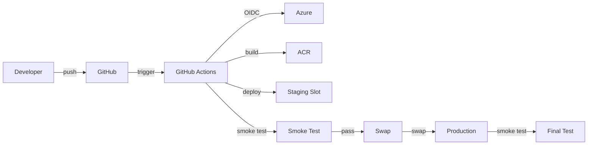

# Deploy na Azure App Service via GitHub Actions

Guia completo para deploy do sistema RAG na Azure usando Azure App Service com multi-container (docker-compose), GitHub Actions com OIDC, Key Vault para secrets, e Azure Files para persistência.

## Índice

1. [Arquitetura](#arquitetura)
2. [Pré-requisitos](#pré-requisitos)
3. [Configurar OIDC (Federated Credentials)](#configurar-oidc-federated-credentials)
4. [Bootstrap da Infraestrutura](#bootstrap-da-infraestrutura)
5. [Como Funciona a Pipeline](#como-funciona-a-pipeline)
6. [Rollback](#rollback)
7. [Observabilidade](#observabilidade)
8. [Troubleshooting](#troubleshooting)

## Arquitetura

O deploy utiliza:

- **Azure App Service (Linux)**: Multi-container com docker-compose
  - API (FastAPI): Container principal
  - Qdrant: Vector database
  - Redis: Cache e rate limiting
- **Azure Container Registry (ACR)**: `acrchoperia` - armazenamento de imagens
- **Azure Key Vault**: Armazenamento seguro de secrets
- **Azure Files**: Persistência para Qdrant (montado em `/mnt/qdrant`)
- **GitHub Actions**: CI/CD com OIDC (sem secrets no GitHub)

### Fluxo de Deploy



## Pré-requisitos

### 1. Azure CLI

```bash
# Instalar (Windows)
# https://aka.ms/installazurecliwindows

# Instalar (Linux/Mac)
curl -sL https://aka.ms/InstallAzureCLIDeb | sudo bash

# Verificar
az --version
```

### 2. Python 3.12+

```bash
python --version  # Deve ser 3.12 ou superior
```

### 3. Permissões na Azure

Você precisa de uma das seguintes roles na subscription:
- **Owner**
- **Contributor** + **User Access Administrator**

### 4. ACR Existente

O ACR `acrchoperia` deve existir (ou será criado pelo bootstrap se tiver permissões).

### 5. Arquivo .env

Crie um arquivo `.env` na raiz do projeto com todas as variáveis necessárias (veja `env.example`).

## Configurar OIDC (Federated Credentials)

O GitHub Actions usa OIDC para autenticar na Azure **sem precisar de secrets**. Configure federated credentials:

### Opção Rápida: Script Automatizado (PowerShell)

```powershell
# Execute o script que faz tudo automaticamente
# Ele cria o Resource Group se não existir
.\infra\setup_oidc.ps1 -GitHubOrg "seu-usuario-ou-org" -GitHubRepo "teste-overlabs"
```

O script:
- Cria o Resource Group se não existir
- Cria o App Registration
- Cria o Service Principal
- Concede permissões (Contributor no RG, AcrPush no ACR se existir)
- Cria federated credentials
- Mostra os valores para adicionar no GitHub Secrets

### Opção Manual: Passo a Passo

### Passo 1: Obter Informações do GitHub

1. Vá para seu repositório GitHub
2. Settings → Actions → General
3. Anote o **Repository ID** (ex: `123456789`)

### Passo 2: Criar App Registration no Azure AD

#### PowerShell (Windows)

```powershell
# Login na Azure
az login

# Criar App Registration
$APP_NAME = "github-actions-rag-overlabs"
$APP_ID = az ad app create --display-name $APP_NAME --query appId -o tsv
Write-Host "App ID: $APP_ID"

# Criar Service Principal
$SP_ID = az ad sp create --id $APP_ID --query id -o tsv
Write-Host "Service Principal ID: $SP_ID"

# Dar permissões (Contributor no Resource Group)
$RESOURCE_GROUP = "rg-overlabs-prod"
$SUBSCRIPTION_ID = az account show --query id -o tsv
az role assignment create `
  --role "Contributor" `
  --assignee $SP_ID `
  --scope "/subscriptions/$SUBSCRIPTION_ID/resourceGroups/$RESOURCE_GROUP"

# Dar permissão para ACR (AcrPush)
$ACR_NAME = "acrchoperia"
az role assignment create `
  --role "AcrPush" `
  --assignee $SP_ID `
  --scope "/subscriptions/$SUBSCRIPTION_ID/resourceGroups/$RESOURCE_GROUP/providers/Microsoft.ContainerRegistry/registries/$ACR_NAME"
```

#### Bash (Linux/macOS/WSL)

```bash
# Login na Azure
az login

# Criar App Registration
APP_NAME="github-actions-rag-overlabs"
APP_ID=$(az ad app create --display-name "$APP_NAME" --query appId -o tsv)
echo "App ID: $APP_ID"

# Criar Service Principal
SP_ID=$(az ad sp create --id $APP_ID --query id -o tsv)
echo "Service Principal ID: $SP_ID"

# Dar permissões (Contributor no Resource Group)
RESOURCE_GROUP="rg-overlabs-prod"
SUBSCRIPTION_ID=$(az account show --query id -o tsv)
az role assignment create \
  --role "Contributor" \
  --assignee $SP_ID \
  --scope /subscriptions/$SUBSCRIPTION_ID/resourceGroups/$RESOURCE_GROUP

# Dar permissão para ACR (AcrPush)
ACR_NAME="acrchoperia"
az role assignment create \
  --role "AcrPush" \
  --assignee $SP_ID \
  --scope /subscriptions/$SUBSCRIPTION_ID/resourceGroups/$RESOURCE_GROUP/providers/Microsoft.ContainerRegistry/registries/$ACR_NAME
```

### Passo 3: Configurar Federated Credentials

#### PowerShell (Windows)

```powershell
# Substituir valores
$GITHUB_ORG = "seu-org"  # ou seu usuário se repo pessoal
$GITHUB_REPO = "teste-overlabs"
$GITHUB_REPO_ID = "123456789"  # Repository ID do GitHub (obter em Settings → General)
$SUBSCRIPTION_ID = az account show --query id -o tsv

# Criar federated credential para branch main
$mainParams = @{
    name = "github-actions-main"
    issuer = "https://token.actions.githubusercontent.com"
    subject = "repo:$GITHUB_ORG/$GITHUB_REPO`:ref:refs/heads/main"
    audiences = @("api://AzureADTokenExchange")
} | ConvertTo-Json -Compress

az ad app federated-credential create `
  --id $APP_ID `
  --parameters $mainParams

# Criar federated credential para tags
$tagsParams = @{
    name = "github-actions-tags"
    issuer = "https://token.actions.githubusercontent.com"
    subject = "repo:$GITHUB_ORG/$GITHUB_REPO`:ref:refs/tags/*"
    audiences = @("api://AzureADTokenExchange")
} | ConvertTo-Json -Compress

az ad app federated-credential create `
  --id $APP_ID `
  --parameters $tagsParams
```

#### Bash (Linux/macOS/WSL)

```bash
# Substituir valores
GITHUB_ORG="seu-org"  # ou seu usuário se repo pessoal
GITHUB_REPO="teste-overlabs"
GITHUB_REPO_ID="123456789"  # Repository ID do GitHub
SUBSCRIPTION_ID=$(az account show --query id -o tsv)

# Criar federated credential para branch main
az ad app federated-credential create \
  --id $APP_ID \
  --parameters '{
    "name": "github-actions-main",
    "issuer": "https://token.actions.githubusercontent.com",
    "subject": "repo:'$GITHUB_ORG'/'$GITHUB_REPO':ref:refs/heads/main",
    "audiences": ["api://AzureADTokenExchange"]
  }'

# Criar federated credential para tags
az ad app federated-credential create \
  --id $APP_ID \
  --parameters '{
    "name": "github-actions-tags",
    "issuer": "https://token.actions.githubusercontent.com",
    "subject": "repo:'$GITHUB_ORG'/'$GITHUB_REPO':ref:refs/tags/*",
    "audiences": ["api://AzureADTokenExchange"]
  }'
```

### Passo 4: Configurar Secrets no GitHub

**IMPORTANTE**: Com OIDC, você só precisa dos IDs, não das chaves!

#### Como acessar a página de Secrets:

1. **No seu repositório GitHub**, vá para:
   - Clique no nome do repositório (ex: `teste-overlabs`)
   - Clique em **Settings** (no topo da página, ao lado de "Insights")
   - No menu lateral esquerdo, vá em **Secrets and variables** → **Actions**

   **Ou acesse diretamente:**
   ```
   https://github.com/<seu-usuario-ou-org>/teste-overlabs/settings/secrets/actions
   ```

2. **Obter os valores necessários:**

   **PowerShell:**
   ```powershell
   # Obter Tenant ID e Subscription ID
   az account show --query "{tenantId:tenantId, subscriptionId:id}" -o table
   
   # Ou individualmente:
   $TENANT_ID = az account show --query tenantId -o tsv
   $SUBSCRIPTION_ID = az account show --query id -o tsv
   Write-Host "Tenant ID: $TENANT_ID"
   Write-Host "Subscription ID: $SUBSCRIPTION_ID"
   
   # O CLIENT_ID é o APP_ID que você obteve no Passo 2
   # (o valor de $APP_ID)
   ```
   
   **Bash:**
   ```bash
   # Obter Tenant ID e Subscription ID
   az account show --query "{tenantId:tenantId, subscriptionId:id}" -o table
   
   # Ou individualmente:
   az account show --query tenantId -o tsv
   az account show --query id -o tsv
   
   # O CLIENT_ID é o APP_ID que você obteve no Passo 2
   # (o valor de $APP_ID)
   ```

3. **Adicionar os Secrets:**

   Na página de Secrets, clique em **"New repository secret"** e adicione:

   - **Name:** `AZURE_CLIENT_ID`
     - **Value:** O `APP_ID` obtido no Passo 2 (ex: `12345678-1234-1234-1234-123456789012`)

   - **Name:** `AZURE_TENANT_ID`
     - **Value:** O Tenant ID da sua subscription (ex: `87654321-4321-4321-4321-210987654321`)

   - **Name:** `AZURE_SUBSCRIPTION_ID`
     - **Value:** O Subscription ID (ex: `11111111-2222-3333-4444-555555555555`)

4. **Verificar:**

   Após adicionar, você deve ver os 3 secrets listados:
   - `AZURE_CLIENT_ID` (visível apenas como `***`)
   - `AZURE_TENANT_ID` (visível apenas como `***`)
   - `AZURE_SUBSCRIPTION_ID` (visível apenas como `***`)

**NÃO** adicione `AZURE_CLIENT_SECRET` - OIDC não precisa de client secret!

#### Screenshot da localização:

```
Repositório GitHub
  └─ Settings (topo da página)
      └─ Secrets and variables (menu lateral)
          └─ Actions
              └─ New repository secret (botão)
```

## Bootstrap da Infraestrutura

O script `infra/bootstrap_azure.py` cria toda a infraestrutura de forma idempotente.

### Executar Bootstrap

**PowerShell:**
```powershell
# Validar .env primeiro (opcional)
python infra/validate_env.py --env .env --show-classification

# Executar bootstrap
python infra/bootstrap_azure.py --env .env --stage prod --location brazilsouth
```

**Bash:**
```bash
# Validar .env primeiro (opcional)
python infra/validate_env.py --env .env --show-classification

# Executar bootstrap
python infra/bootstrap_azure.py --env .env --stage prod --location brazilsouth
```

### O que o Bootstrap Cria

1. **Resource Group**: `rg-overlabs-prod`
2. **ACR**: `acrchoperia` (reutiliza se existir)
3. **Key Vault**: `kv-overlabs-prod-XXX` (suffix random)
4. **App Service Plan**: `asp-overlabs-prod-XXX` (Linux, Standard S1 - suporta slots)
5. **Web App**: `app-overlabs-prod-XXX` (Linux, multi-container)
6. **Storage Account**: `saoverlabsprodXXX` (Azure Files)
7. **File Share**: `qdrant-storage`
8. **Staging Slot**: `staging`

### O que o Bootstrap Configura

- **Managed Identity**: Habilitado na Web App
- **Key Vault Permissions**: Get/List secrets para Managed Identity
- **App Settings**: 
  - Secrets → Key Vault references (`@Microsoft.KeyVault(SecretUri=...)`)
  - Non-secrets → Valores diretos
- **Azure Files Mount**: `/mnt/qdrant` para persistência do Qdrant

### Estado de Deploy

Após o bootstrap, o arquivo `.azure/deploy_state.json` é criado com metadados (sem secrets):

```json
{
  "subscriptionId": "...",
  "tenantId": "...",
  "resourceGroup": "rg-overlabs-prod",
  "location": "brazilsouth",
  "acrName": "acrchoperia",
  "keyVaultName": "kv-overlabs-prod-123",
  "appServiceName": "app-overlabs-prod-123",
  ...
}
```

**IMPORTANTE**: Este arquivo é gitignored. Não commite!

### Upgrade do App Service Plan para Standard

O bootstrap agora cria planos com **Standard S1** por padrão (suporta slots). Se você já tem um plano Basic e quer fazer upgrade:

**Script Automatizado (Recomendado):**

```powershell
# Obter nomes do deploy_state.json
$state = Get-Content .azure/deploy_state.json | ConvertFrom-Json
.\infra\upgrade_to_standard.ps1 -AppServicePlanName $state.appServicePlanName -ResourceGroup $state.resourceGroup
```

O script irá:
1. Verificar o SKU atual
2. Fazer upgrade de Basic (B1) para Standard (S1)
3. Criar o staging slot automaticamente (se ainda não existir)

**Manual:**

```powershell
# 1. Fazer upgrade
az appservice plan update --name asp-overlabs-prod-XXX --resource-group rg-overlabs-prod --sku S1

# 2. Criar staging slot
az webapp deployment slot create --name app-overlabs-prod-XXX --resource-group rg-overlabs-prod --slot staging --configuration-source app-overlabs-prod-XXX
```

**Nota**: O upgrade aumenta o custo mensal. Standard S1 é mais caro que Basic B1, mas permite:
- Deployment slots (blue-green deployment)
- Auto-scaling
- Melhor performance

## Como Funciona a Pipeline

A pipeline `.github/workflows/deploy-azure.yml` executa automaticamente em:

- Push para `main`
- Tags `v*`
- Manual (workflow_dispatch)

### Jobs da Pipeline

1. **validate**: Valida `.env` e verifica `deploy_state.json`
2. **build**: 
   - Build da imagem API
   - Push para ACR (tags: `latest`, `${GITHUB_SHA}`)
   - Scan com Trivy (falha em CVEs HIGH/CRITICAL)
3. **deploy-staging**: 
   - Gera `docker-compose.deploy.yml` com `IMAGE_TAG=${GITHUB_SHA}`
   - Deploy no slot staging
   - Restart do slot
4. **smoke-staging**: 
   - Aguarda 30s
   - Testa `/healthz` e `/readyz` no staging
   - Falha se não passar
5. **swap**: 
   - Swap staging → production (apenas se smoke passar)
6. **smoke-prod**: 
   - Testa produção após swap
   - Gera summary no GitHub

### Concurrency

A pipeline usa `concurrency.group` para evitar deploys paralelos:
- Novos commits cancelam runs anteriores
- Apenas um deploy por vez

## Rollback

### Opção 1: Redeploy com Tag Anterior

**PowerShell:**
```powershell
# Listar tags disponíveis
az acr repository show-tags --name acrchoperia --repository choperia-api --output table

# Fazer deploy manual com tag específica
$IMAGE_TAG = "<commit-sha-anterior>"
$composeContent = Get-Content docker-compose.azure.yml -Raw
$composeContent = $composeContent -replace '\$\{IMAGE_TAG:-latest\}', $IMAGE_TAG
$composeContent | Out-File -FilePath docker-compose.deploy.yml -Encoding utf8

az webapp config container set `
  --name app-overlabs-prod-XXX `
  --resource-group rg-overlabs-prod `
  --multicontainer-config-type compose `
  --multicontainer-config-file docker-compose.deploy.yml
```

**Bash:**
```bash
# Listar tags disponíveis
az acr repository show-tags --name acrchoperia --repository choperia-api --output table

# Fazer deploy manual com tag específica
IMAGE_TAG="<commit-sha-anterior>"
az webapp config container set \
  --name app-overlabs-prod-XXX \
  --resource-group rg-overlabs-prod \
  --multicontainer-config-type compose \
  --multicontainer-config-file <(sed "s/\${IMAGE_TAG:-latest}/$IMAGE_TAG/g" docker-compose.azure.yml)
```

### Opção 2: Swap de Volta

Se o swap foi feito recentemente, você pode fazer swap de volta:

**PowerShell:**
```powershell
az webapp deployment slot swap `
  --resource-group rg-overlabs-prod `
  --name app-overlabs-prod-XXX `
  --slot staging `
  --target-slot production
```

**Bash:**
```bash
az webapp deployment slot swap \
  --resource-group rg-overlabs-prod \
  --name app-overlabs-prod-XXX \
  --slot staging \
  --target-slot production
```

**Nota**: Isso só funciona se o staging ainda tiver a versão anterior.

### Opção 3: Reverter via GitHub

1. Vá para Actions → Deploy to Azure
2. Encontre o último deploy bem-sucedido
3. Clique em "Re-run jobs" → Selecione o job `swap`
4. Isso fará swap de volta (se staging ainda tiver versão anterior)

## Observabilidade

### Logs do App Service

**PowerShell:**
```powershell
# Logs em tempo real
az webapp log tail `
  --name app-overlabs-prod-XXX `
  --resource-group rg-overlabs-prod

# Logs do container específico
az webapp log tail `
  --name app-overlabs-prod-XXX `
  --resource-group rg-overlabs-prod `
  --container api
```

**Bash:**
```bash
# Logs em tempo real
az webapp log tail \
  --name app-overlabs-prod-XXX \
  --resource-group rg-overlabs-prod

# Logs do container específico
az webapp log tail \
  --name app-overlabs-prod-XXX \
  --resource-group rg-overlabs-prod \
  --container api
```

### Métricas

Acesse no Portal Azure:
- App Service → Metrics
- Métricas disponíveis: CPU, Memory, Requests, Response Time

### Application Insights (Opcional)

Para observabilidade avançada, configure Application Insights:

**PowerShell:**
```powershell
# Criar Application Insights
az monitor app-insights component create `
  --app app-insights-overlabs `
  --location brazilsouth `
  --resource-group rg-overlabs-prod

# Conectar ao App Service
$APPINSIGHTS_KEY = az monitor app-insights component show `
  --app app-insights-overlabs `
  --resource-group rg-overlabs-prod `
  --query instrumentationKey -o tsv

az webapp config appsettings set `
  --name app-overlabs-prod-XXX `
  --resource-group rg-overlabs-prod `
  --settings APPINSIGHTS_INSTRUMENTATIONKEY=$APPINSIGHTS_KEY
```

**Bash:**
```bash
# Criar Application Insights
az monitor app-insights component create \
  --app app-insights-overlabs \
  --location brazilsouth \
  --resource-group rg-overlabs-prod

# Conectar ao App Service
APPINSIGHTS_KEY=$(az monitor app-insights component show \
  --app app-insights-overlabs \
  --resource-group rg-overlabs-prod \
  --query instrumentationKey -o tsv)

az webapp config appsettings set \
  --name app-overlabs-prod-XXX \
  --resource-group rg-overlabs-prod \
  --settings APPINSIGHTS_INSTRUMENTATIONKEY=$APPINSIGHTS_KEY
```

## Troubleshooting

### Pipeline falha em "Login to Azure"

**Problema**: Erro de autenticação OIDC

**Solução**:
1. Verificar se federated credentials estão configuradas corretamente
2. Verificar se `AZURE_CLIENT_ID`, `AZURE_TENANT_ID`, `AZURE_SUBSCRIPTION_ID` estão nos secrets do GitHub
3. Verificar permissões do Service Principal (Contributor + AcrPush)

### Build falha com "unauthorized"

**Problema**: Sem permissão para push no ACR

**Solução**:
**PowerShell:**
```powershell
# Dar permissão AcrPush ao Service Principal
$SP_ID = "<SP_ID>"
$SUB_ID = az account show --query id -o tsv
az role assignment create `
  --role "AcrPush" `
  --assignee $SP_ID `
  --scope "/subscriptions/$SUB_ID/resourceGroups/rg-overlabs-prod/providers/Microsoft.ContainerRegistry/registries/acrchoperia"
```

**Bash:**
```bash
# Dar permissão AcrPush ao Service Principal
az role assignment create \
  --role "AcrPush" \
  --assignee <SP_ID> \
  --scope /subscriptions/<SUB_ID>/resourceGroups/rg-overlabs-prod/providers/Microsoft.ContainerRegistry/registries/acrchoperia
```

### Deploy falha com "container not found"

**Problema**: Imagem não existe no ACR

**Solução**:
1. Verificar se build passou
2. Verificar tags no ACR: `az acr repository show-tags --name acrchoperia --repository choperia-api`
3. Verificar se `IMAGE_TAG` está correto no compose

### Smoke test falha

**Problema**: `/healthz` ou `/readyz` não respondem

**Solução**:
1. Verificar logs: `az webapp log tail --name app-overlabs-prod-XXX --resource-group rg-overlabs-prod`
2. Verificar se containers estão rodando: Portal Azure → App Service → Container settings
3. Verificar App Settings (especialmente `QDRANT_URL`, `REDIS_URL`)
4. Verificar se Azure Files mount está configurado

### Key Vault references não funcionam

**Problema**: App Settings com `@Microsoft.KeyVault(...)` retornam erro

**Solução**:
1. Verificar Managed Identity está habilitado: `az webapp identity show --name app-overlabs-prod-XXX --resource-group rg-overlabs-prod`
2. Verificar permissões no Key Vault: `az keyvault show --name kv-overlabs-prod-XXX --query properties.accessPolicies`
3. Verificar se secret existe: `az keyvault secret list --vault-name kv-overlabs-prod-XXX`

### Qdrant não persiste dados

**Problema**: Dados são perdidos após restart

**Solução**:
1. Verificar Azure Files mount: Portal Azure → App Service → Configuration → Path mappings
2. Verificar se volume está mapeado corretamente no compose
3. Verificar permissões do Storage Account

### Swap falha

**Problema**: Erro ao fazer swap

**Solução**:
1. Verificar se staging slot existe
2. Verificar se staging está saudável (smoke test passou)
3. Verificar se não há conflitos de configuração entre slots

### Staging slot não existe (App Service Plan Basic)

**Problema**: `The Resource 'Microsoft.Web/sites/.../slots/staging' under resource group '...' was not found.`

**Causa**: App Service Plan **B1 (Basic)** não suporta deployment slots. Apenas planos **Standard** e superiores suportam slots.

**Solução - Upgrade para Standard (Recomendado)**:

Use o script automatizado para fazer upgrade:

```powershell
# Obter nomes do deploy_state.json
$state = Get-Content .azure/deploy_state.json | ConvertFrom-Json
.\infra\upgrade_to_standard.ps1 -AppServicePlanName $state.appServicePlanName -ResourceGroup $state.resourceGroup
```

O script irá:
1. Verificar o SKU atual
2. Fazer upgrade de Basic (B1) para Standard (S1)
3. Criar o staging slot automaticamente (se ainda não existir)

**Alternativa Manual**:

```powershell
# 1. Fazer upgrade do plano
az appservice plan update --name asp-overlabs-prod-XXX --resource-group rg-overlabs-prod --sku S1

# 2. Criar staging slot
az webapp deployment slot create --name app-overlabs-prod-XXX --resource-group rg-overlabs-prod --slot staging --configuration-source app-overlabs-prod-XXX
```

**Nota**: 
- O workflow foi ajustado para detectar automaticamente se o slot existe. Se não existir, faz deploy direto na produção.
- Com plano Basic, não há staging slot, então o deploy é feito diretamente na produção. Isso é menos seguro, mas funcional.
- **Para ambientes de produção, recomenda-se fortemente upgrade para Standard** para ter slots e blue-green deployment.
- O bootstrap script agora cria novos planos com **Standard S1** por padrão.

### Erro no pip-audit: formato inválido

**Problema**: `pip-audit: error: argument -f/--format: invalid OutputFormatChoice value: 'text'`

**Causa**: O formato `text` não é válido na versão atual do pip-audit.

**Solução**: O workflow foi corrigido para remover o parâmetro `--format text`. O pip-audit agora usa o formato padrão (table).

### Warning no Trivy: parâmetro não suportado

**Problema**: `Unexpected input(s) 'skip-version-check'`

**Causa**: A versão atual da action `aquasecurity/trivy-action@master` não suporta mais o parâmetro `skip-version-check`.

**Solução**: O parâmetro foi removido do workflow. O Trivy continuará funcionando normalmente, apenas mostrará avisos de versão se houver atualizações disponíveis.

### Warning no Semgrep: parâmetros inválidos

**Problema**: `Unexpected input(s) 'generateSarif', 'generateGitHubSARIF', 'publishSarif'`

**Causa**: A action `returntocorp/semgrep-action@v1` não aceita esses parâmetros na sintaxe atual.

**Solução**: O workflow foi ajustado para executar Semgrep via CLI diretamente, permitindo maior controle sobre a configuração e saída.

### Vulnerabilidade de Shell Injection no Workflow

**Problema**: Semgrep detectou possível shell injection no workflow ao usar `${{ github.event.head_commit.message }}` diretamente no shell.

**Causa**: Valores do contexto GitHub podem conter caracteres especiais que podem ser interpretados pelo shell.

**Solução**: O workflow foi corrigido para usar variáveis de ambiente intermediárias (`env:`) antes de usar valores do contexto GitHub em comandos shell. Isso previne injeção de código malicioso.

**Exemplo de correção**:
```yaml
# ❌ ANTES (vulnerável)
run: |
  echo "Commit: ${{ github.event.head_commit.message }}" >> $GITHUB_STEP_SUMMARY

# ✅ DEPOIS (seguro)
env:
  COMMIT_MSG: ${{ github.event.head_commit.message }}
run: |
  echo "Commit: $COMMIT_MSG" >> $GITHUB_STEP_SUMMARY
```

## Próximos Passos

- [ ] Configurar Application Insights
- [ ] Adicionar alertas (CPU, Memory, Errors)
- [ ] Implementar blue-green deployment
- [ ] Adicionar testes de integração na pipeline
- [ ] Configurar backup automático do Qdrant (Azure Files snapshot)

## Referências

- [Azure App Service Multi-Container](https://docs.microsoft.com/azure/app-service/tutorial-multi-container-app)
- [GitHub Actions OIDC](https://docs.github.com/actions/deployment/security-hardening-your-deployments/configuring-openid-connect-in-azure)
- [Azure Key Vault References](https://docs.microsoft.com/azure/app-service/app-service-key-vault-references)
