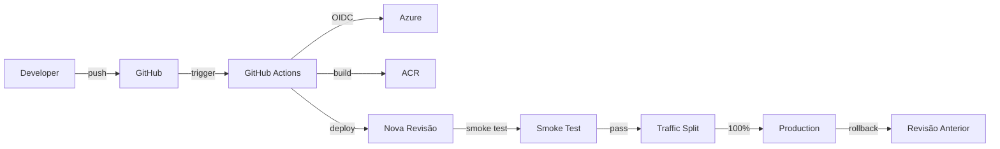

# Deploy na Azure Container Apps via GitHub Actions

Guia completo para deploy do sistema RAG na Azure usando **Azure Container Apps**, GitHub Actions com OIDC, Key Vault para secrets, e Azure Files para persistência.

## Índice

1. [Arquitetura](#arquitetura)
2. [Pré-requisitos](#pré-requisitos)
3. [Configurar OIDC (Federated Credentials)](#configurar-oidc-federated-credentials)
4. [Bootstrap da Infraestrutura](#bootstrap-da-infraestrutura)
5. [Como Funciona a Pipeline](#como-funciona-a-pipeline)
6. [Atualizar Container Apps](#atualizar-container-apps)
7. [Rollback e Revisões](#rollback-e-revisões)
8. [Observabilidade](#observabilidade)
9. [Troubleshooting](#troubleshooting)

## Arquitetura

O deploy utiliza:

- **Azure Container Apps**: Orquestração de containers como microserviços
  - **API Container App**: FastAPI (externa, porta 8000)
  - **Qdrant Container App**: Vector database (interna, porta 6333)
  - **Redis Container App**: Cache e rate limiting (interna, porta 6379)
- **Azure Container Registry (ACR)**: Armazenamento de imagens Docker
- **Azure Key Vault**: Armazenamento seguro de secrets
- **Azure Files**: Persistência para Qdrant (volume montado)
- **Container Apps Environment**: Ambiente isolado para os containers
- **GitHub Actions**: CI/CD com OIDC (sem secrets no GitHub)

### Vantagens do Container Apps

✅ **Rede Interna**: Containers se comunicam via DNS interno (sem expor Qdrant/Redis)  
✅ **Volumes Persistentes**: Qdrant com Azure Files montado  
✅ **Auto-scaling**: Escala automática por container  
✅ **Revisões/Rollbacks**: Cada container app tem revisões independentes  
✅ **Melhor Isolamento**: Cada serviço é independente e pode escalar separadamente  
✅ **Zero-downtime Deployments**: Revisões permitem blue-green deployments nativos

### Fluxo de Deploy



## Pré-requisitos

### 1. Azure CLI

```bash
# Instalar (Windows)
# https://aka.ms/installazurecliwindows

# Instalar (Linux/Mac)
curl -sL https://aka.ms/InstallAzureCLIDeb | sudo bash

# Verificar
az --version
```

### 2. Permissões na Azure

Você precisa de uma das seguintes roles na subscription:
- **Owner**
- **Contributor** + **User Access Administrator**

### 3. Arquivo .env

Crie um arquivo `.env` na raiz do projeto com todas as variáveis necessárias (veja `env.example`).

## Configurar OIDC (Federated Credentials)

O GitHub Actions usa OIDC para autenticar na Azure **sem precisar de secrets**. Configure federated credentials:

### Opção Rápida: Script Automatizado (PowerShell)

```powershell
# Execute o script que faz tudo automaticamente
.\infra\setup_oidc.ps1 -GitHubOrg "leopas-ou-org" -GitHubRepo "teste-overlabs"
```

O script:
- Cria o Resource Group se não existir
- Cria o App Registration
- Cria o Service Principal
- Concede permissões (Contributor no RG, AcrPush no ACR se existir)
- Cria federated credentials para branches, tags e environments
- Mostra os valores para adicionar no GitHub Secrets

### Opção Manual: Passo a Passo

Se preferir fazer manualmente, siga os passos em `docs/github_secrets_setup.md`.

### Configurar Secrets no GitHub

Após executar o script, adicione os seguintes secrets no GitHub:

1. Vá para: `https://github.com/leopas/teste-overlabs/settings/secrets/actions`
2. Adicione:
   - `AZURE_CLIENT_ID`: O Client ID do App Registration
   - `AZURE_TENANT_ID`: O Tenant ID
   - `AZURE_SUBSCRIPTION_ID`: O Subscription ID

## Bootstrap da Infraestrutura

O script `bootstrap_container_apps.ps1` cria toda a infraestrutura necessária de forma idempotente.

### Executar Bootstrap

```powershell
# Bootstrap completo (usa deploy_state.json se já existir)
.\infra\bootstrap_container_apps.ps1 -EnvFile ".env" -Stage "prod" -Location "brazilsouth"

# Ou com parâmetros customizados
.\infra\bootstrap_container_apps.ps1 `
  -ResourceGroup "rg-overlabs-prod" `
  -AcrName "acrchoperia" `
  -EnvFile ".env" `
  -Stage "prod" `
  -Location "brazilsouth"
```

### O que o Bootstrap Cria

1. ✅ **Resource Group**
2. ✅ **Azure Container Registry (ACR)**: `acrchoperia` (ou o nome especificado)
3. ✅ **Azure Key Vault**: Para armazenar secrets
4. ✅ **Azure Container Apps Environment**: Ambiente isolado
5. ✅ **Redis Container App**: Cache interno (ingress interno)
6. ✅ **Qdrant Container App**: Vector database interno com volume persistente (ingress interno)
7. ✅ **API Container App**: API principal (ingress externo)
8. ✅ **Azure Files**: Volume persistente para Qdrant
9. ✅ **Secrets no Key Vault**: Upload automático dos secrets do `.env`
10. ✅ **deploy_state.json**: Metadados dos recursos criados

### Variáveis de Ambiente Configuradas

O bootstrap configura automaticamente:

- **QDRANT_URL**: `http://app-overlabs-qdrant-prod-XXX:6333` (DNS interno)
- **REDIS_URL**: `redis://app-overlabs-redis-prod-XXX:6379/0` (DNS interno)
- **Variáveis não-secretas**: Do arquivo `.env`
- **Secrets**: Key Vault references (`@Microsoft.KeyVault(...)`)

### Após o Bootstrap

O script salva um arquivo `.azure/deploy_state.json` com metadados:

```json
{
  "resourceGroup": "rg-overlabs-prod",
  "acrName": "acrchoperia",
  "keyVaultName": "kv-overlabs-prod-XXX",
  "environmentName": "env-overlabs-prod-XXX",
  "apiAppName": "app-overlabs-prod-XXX",
  "qdrantAppName": "app-overlabs-qdrant-prod-XXX",
  "redisAppName": "app-overlabs-redis-prod-XXX",
  "storageAccountName": "saoverlabsprodXXX",
  "fileShareName": "qdrant-storage"
}
```

## Como Funciona a Pipeline

A pipeline do GitHub Actions (`.github/workflows/deploy-azure.yml`) executa:

1. **Build**: Build da imagem da API usando Docker
2. **Security Scanning**: Trivy (imagens), Bandit (Python), pip-audit (dependências), Semgrep (SAST)
3. **Push para ACR**: Tag por SHA do commit
4. **Deploy**: Cria nova revisão do Container App da API
5. **Smoke Test**: Testa `/healthz` e `/readyz`
6. **Traffic Split**: Se passar, direciona 100% do tráfego para a nova revisão

### Trigger

A pipeline é acionada por:
- Push para `main`
- Tags `v*` (ex: `v1.0.0`)
- Manual via `workflow_dispatch`

## Atualizar Container Apps

### Atualizar API Container App

```powershell
# Carregar deploy state
$state = Get-Content .azure/deploy_state.json | ConvertFrom-Json

# Atualizar com nova imagem
az containerapp update `
  --name $state.apiAppName `
  --resource-group $state.resourceGroup `
  --image "$($state.acrName).azurecr.io/choperia-api:latest"
```

### Atualizar Variáveis de Ambiente

```powershell
# Adicionar/atualizar variável
az containerapp update `
  --name $state.apiAppName `
  --resource-group $state.resourceGroup `
  --set-env-vars "NOVA_VARIAVEL=valor"
```

### Usar Key Vault References

```powershell
# Configurar variável com Key Vault reference
az containerapp update `
  --name $state.apiAppName `
  --resource-group $state.resourceGroup `
  --set-env-vars "OPENAI_API_KEY=@Microsoft.KeyVault(SecretUri=https://$($state.keyVaultName).vault.azure.net/secrets/openai-api-key/)"
```

## Rollback e Revisões

Container Apps mantém revisões de cada deploy, permitindo rollback fácil:

### Listar Revisões

```powershell
$state = Get-Content .azure/deploy_state.json | ConvertFrom-Json

az containerapp revision list `
  --name $state.apiAppName `
  --resource-group $state.resourceGroup `
  --query "[].{name:name,active:properties.active,trafficWeight:properties.trafficWeight,createdTime:properties.createdTime}" `
  -o table
```

### Fazer Rollback

```powershell
# Ativar revisão anterior (100% do tráfego)
az containerapp revision activate `
  --name $state.apiAppName `
  --resource-group $state.resourceGroup `
  --revision <REVISION_NAME>
```

### Traffic Split (Blue-Green)

```powershell
# Dividir tráfego entre revisões (ex: 50% nova, 50% antiga)
az containerapp ingress traffic set `
  --name $state.apiAppName `
  --resource-group $state.resourceGroup `
  --revision-weight <REVISION_NOVA>=50 <REVISION_ANTIGA>=50
```

## Canary Deployment

O pipeline GitHub Actions implementa **Canary Deployment** automaticamente para garantir deploys seguros.

### Como Funciona

1. **Nova revision criada sem tráfego**: Ao atualizar a imagem, uma nova revision é criada automaticamente, mas sem receber tráfego inicial.

2. **Polling de readiness**: O pipeline aguarda a revision ficar pronta usando polling inteligente (não sleep fixo), verificando:
   - `provisioningState == "Succeeded"`
   - `runningState == "Running"` (quando disponível)
   - Replicas ready (se configurado)

3. **Aplicar canary**: Divide o tráfego:
   - **10%** para a nova revision (canary)
   - **90%** para a revision anterior (produção)

4. **Smoke test**: Executa smoke test no canary (com retries aumentados para pegar o 10% do tráfego).

5. **Promover ou rollback**:
   - **Se smoke test OK**: Promove 100% do tráfego para a nova revision
   - **Se smoke test falha**: Rollback automático para a revision anterior (100% tráfego)

### Vantagens

- **Segurança**: Valida nova versão em produção antes de expor todos os usuários
- **Rollback rápido**: Se houver problema, apenas 10% do tráfego é afetado
- **Zero downtime**: Revision anterior continua servindo 90% do tráfego durante o teste
- **Detecção precoce**: Problemas são detectados antes de promover 100%

### Configuração

O peso do canary é configurável via variável de ambiente no workflow:

```yaml
env:
  CANARY_WEIGHT: 10  # 10% tráfego para nova revision
```

Para reduzir risco, pode diminuir para 5%:

```yaml
env:
  CANARY_WEIGHT: 5  # 5% tráfego (mais conservador)
```

### Polling vs Sleep Fixo

**Antes**: O pipeline usava `sleep 30` fixo, que podia ser muito ou pouco tempo.

**Agora**: Usa polling inteligente que:
- Verifica estado real da revision
- Detecta quando está pronta (não espera desnecessariamente)
- Detecta falhas imediatamente
- Timeout configurável (default: 5 minutos)

### Rollback Automático

Se o smoke test falhar após aplicar o canary, o pipeline executa rollback automático:

1. Restaura 100% do tráfego para a revision anterior
2. Nova revision fica inativa (sem tráfego)
3. Job falha com mensagem clara
4. Summary mostra comandos de rollback manual (se necessário)

### Troubleshooting Canary

#### Revision não fica ready

**Sintoma**: Polling timeout após 5 minutos

**Solução**:
1. Verificar logs do Container App:
   ```powershell
   az containerapp logs show `
     --name $state.apiAppName `
     --resource-group $state.resourceGroup `
     --follow
   ```
2. Verificar estado da revision:
   ```powershell
   az containerapp revision show `
     --name $state.apiAppName `
     --resource-group $state.resourceGroup `
     --revision <REVISION_NAME>
   ```

#### Smoke test falha no canary

**Sintoma**: Smoke test retorna erro mesmo com canary aplicado

**Possíveis causas**:
- Smoke test não está pegando o canary (10% tráfego) - normal, retries aumentados ajudam
- Nova revision tem bug real
- Problemas de rede temporários

**Solução**:
1. Verificar se canary foi aplicado:
   ```powershell
   az containerapp revision list `
     --name $state.apiAppName `
     --resource-group $state.resourceGroup `
     --query "[].{name:name,trafficWeight:properties.trafficWeight}" `
     -o table
   ```
2. Verificar logs da nova revision
3. Se necessário, fazer rollback manual (comandos no summary do GitHub Actions)

Para mais detalhes sobre o pipeline, veja [docs/ci_cd.md](ci_cd.md).

## Observabilidade

### Logs

```powershell
# Logs em tempo real da API
az containerapp logs show `
  --name $state.apiAppName `
  --resource-group $state.resourceGroup `
  --follow

# Logs do Qdrant
az containerapp logs show `
  --name $state.qdrantAppName `
  --resource-group $state.resourceGroup `
  --follow
```

### Métricas

Acesse o portal Azure:
- Container Apps → Seu App → Monitoring → Metrics

### Application Insights (Opcional)

Para integração com Application Insights, configure no Container Apps Environment:

```powershell
az containerapp env update `
  --name $state.environmentName `
  --resource-group $state.resourceGroup `
  --app-insights <INSTRUMENTATION_KEY>
```

## Troubleshooting

### Container App não inicia

**Problema**: Container App fica em estado "Not Running"

**Solução**:
1. Verificar logs: `az containerapp logs show --name <app-name> --resource-group <rg>`
2. Verificar variáveis de ambiente
3. Verificar se a imagem existe no ACR
4. Verificar recursos (CPU/memória) do Container App

### Erro 503 na API

**Problema**: API retorna 503

**Solução**:
1. Verificar se Qdrant e Redis estão rodando:
   ```powershell
   az containerapp show --name $state.qdrantAppName --resource-group $state.resourceGroup --query "properties.runningStatus"
   az containerapp show --name $state.redisAppName --resource-group $state.resourceGroup --query "properties.runningStatus"
   ```
2. Verificar URLs internas (QDRANT_URL, REDIS_URL)
3. Verificar logs da API

### Key Vault references não funcionam

**Problema**: Variáveis com `@Microsoft.KeyVault(...)` retornam erro

**Solução**:
1. Verificar Managed Identity está habilitado no Container App:
   ```powershell
   az containerapp identity show --name $state.apiAppName --resource-group $state.resourceGroup
   ```
2. Se não estiver, habilitar:
   ```powershell
   az containerapp identity assign --name $state.apiAppName --resource-group $state.resourceGroup
   ```
3. Conceder permissões no Key Vault:
   ```powershell
   $principalId = az containerapp identity show --name $state.apiAppName --resource-group $state.resourceGroup --query principalId -o tsv
   az role assignment create `
     --scope "/subscriptions/<SUB_ID>/resourceGroups/$($state.resourceGroup)/providers/Microsoft.KeyVault/vaults/$($state.keyVaultName)" `
     --assignee $principalId `
     --role "Key Vault Secrets User"
   ```

### Qdrant não persiste dados

**Problema**: Dados são perdidos após restart

**Solução**:
1. Verificar se o volume está montado:
   ```powershell
   az containerapp show --name $state.qdrantAppName --resource-group $state.resourceGroup --query "properties.template.containers[0].volumeMounts"
   ```
2. Verificar Azure Files mount no Environment:
   ```powershell
   az containerapp env storage list --name $state.environmentName --resource-group $state.resourceGroup
   ```

### Imagem não encontrada no ACR

**Problema**: `ImagePullBackOff` ou erro ao puxar imagem

**Solução**:
1. Verificar se a imagem existe:
   ```powershell
   az acr repository show-tags --name $state.acrName --repository choperia-api
   ```
2. Verificar credenciais do ACR no Container App
3. Se usar Managed Identity, conceder permissão `AcrPull`:
   ```powershell
   $principalId = az containerapp identity show --name $state.apiAppName --resource-group $state.resourceGroup --query principalId -o tsv
   az role assignment create `
     --scope "/subscriptions/<SUB_ID>/resourceGroups/$($state.resourceGroup)/providers/Microsoft.ContainerRegistry/registries/$($state.acrName)" `
     --assignee $principalId `
     --role "AcrPull"
   ```

### Pipeline falha no deploy

**Problema**: GitHub Actions falha ao fazer deploy

**Solução**:
1. Verificar se OIDC está configurado corretamente
2. Verificar se os secrets do GitHub estão corretos
3. Verificar permissões do Service Principal
4. Verificar logs da pipeline no GitHub Actions

## Migração de App Service para Container Apps

Se você já tinha uma instalação usando Azure App Service e quer migrar para Container Apps:

### 1. Limpar Recursos Antigos do App Service

Use o script de limpeza para remover recursos do App Service:

```powershell
# O script detecta automaticamente os recursos do deploy_state.json
.\infra\cleanup_app_service.ps1

# Ou especifique o Resource Group manualmente
.\infra\cleanup_app_service.ps1 -ResourceGroup "rg-overlabs-prod"

# Para pular confirmação (use com cuidado!)
.\infra\cleanup_app_service.ps1 -Force
```

O script remove:
- ✅ App Service (Web App)
- ✅ App Service Plan
- ✅ Staging Slots

O script **NÃO remove**:
- ✅ Resource Group
- ✅ ACR (Container Registry)
- ✅ Key Vault
- ✅ Storage Account
- ✅ File Share

### 2. Executar Bootstrap para Container Apps

Após limpar os recursos antigos, execute o bootstrap:

```powershell
.\infra\bootstrap_container_apps.ps1 -EnvFile ".env" -Stage "prod" -Location "brazilsouth"
```

### 3. Atualizar deploy_state.json

O novo bootstrap criará um novo `deploy_state.json` com informações dos Container Apps.

## Próximos Passos

1. **Build e Push da Imagem**: Execute a pipeline do GitHub Actions ou faça build manual
2. **Configurar Managed Identity**: Para acesso ao Key Vault sem secrets
3. **Aplicar Schema SQL**: Se usar MySQL para audit logging
4. **Upload de Documentos**: Para o Qdrant via script de ingest
5. **Configurar Alertas**: No portal Azure para monitoramento

## Referências

- [Azure Container Apps Documentation](https://learn.microsoft.com/azure/container-apps/)
- [Container Apps Environment](https://learn.microsoft.com/azure/container-apps/environment)
- [Container Apps Revisions](https://learn.microsoft.com/azure/container-apps/revisions)
- [Key Vault References](https://learn.microsoft.com/azure/container-apps/reference-key-vault-secret)
