# Galeria de Diagramas

Diagramas Mermaid usados na documentação. Cada um está ligado ao doc onde o fluxo ou a decisão é explicada.

---

## A) Contexto e containers (C4-like)

**Onde é explicado:** [Arquitetura](architecture.md#contexto-e-containers).

---

## B) Deployment (Docker Compose)

**Onde é explicado:** [Arquitetura](architecture.md#deployment-docker-compose), [Runbook](runbook.md).

---

## C) Sequência do /ask (detalhado)

**Onde é explicado:** [Arquitetura](architecture.md#fluxo-do-ask), [Observabilidade](observability.md).

---

## D) Pipeline de ingestão

**Onde é explicado:** [Arquitetura](architecture.md#pipeline-de-ingestão), [Runbook](runbook.md).

---

## E) ER do schema de audit

**Onde é explicado:** [Audit logging](audit_logging.md#schema-mysql).

```mermaid
erDiagram
    audit_session ||--o{ audit_message : "session_id"
    audit_session ||--o{ audit_ask : "session_id"
    audit_ask ||--o{ audit_retrieval_chunk : "trace_id"
    audit_ask ||--o| audit_vector_fingerprint : "trace_id"

    audit_session {
        varchar session_id PK
        varchar user_id
        datetime last_seen_at
    }
    audit_message {
        bigint id PK
        varchar session_id FK
        varchar trace_id
        enum role
        char text_hash
        mediumtext text_redacted
        longtext text_raw_enc
    }
    audit_ask {
        varchar trace_id PK
        varchar request_id
        varchar session_id FK
        varchar question_hash
        varchar answer_hash
        enum answer_source
        varchar refusal_reason
        text firewall_rule_ids
        boolean cache_hit
    }
    audit_retrieval_chunk {
        bigint id PK
        varchar trace_id FK
        int rank
        varchar path
        float score_final
        char text_hash
    }
    audit_vector_fingerprint {
        varchar trace_id PK,FK
        varchar vector_hash
    }
```

---

## F) Observabilidade

**Onde é explicado:** [Observabilidade](observability.md).

---

## G) Gates de segurança (request)

**Onde é explicado:** [Segurança](security.md#gates-do-request).

